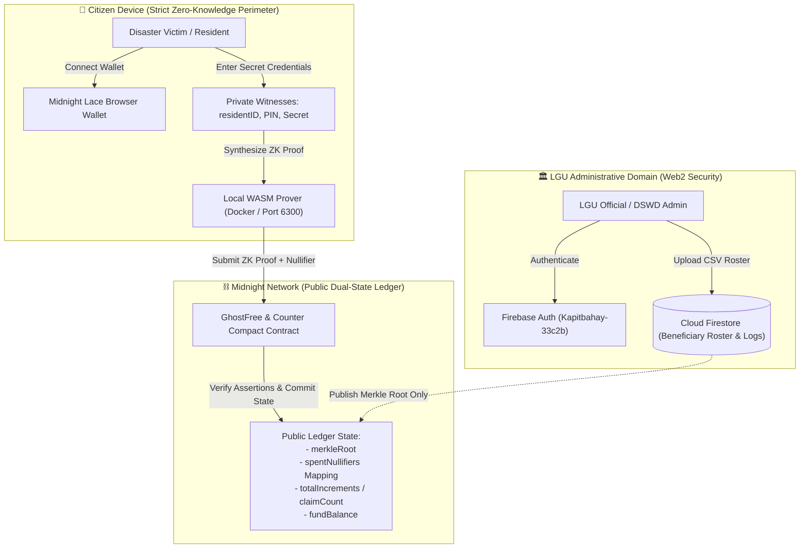

# GhostFree — Decentralized Privacy-First Calamity Aid & Counter Contract

[](https://github.com/zneright/GhostFree/actions/workflows/ci.yml)
[](https://midnight.network)
[](https://docs.midnight.network)
[](LICENSE)
[](https://vitest.dev)
[](https://nodejs.org)
[](https://ghost-free-eight.vercel.app)
[](USERS.md)
[](https://x.com/GhostFreepwhq)

> **"Stop the ghosts. Protect the people."**  
> Privacy-preserving zero-knowledge calamity aid distribution and counter contract built on the Midnight Network.

---

## Live Demo

- **Live Demo:** [https://ghost-free-eight.vercel.app/](https://ghost-free-eight.vercel.app/)
- **Vercel Deployment:** [https://ghost-free-eight.vercel.app/](https://ghost-free-eight.vercel.app/)
- **X (Twitter):** [@GhostFreepwhq](https://x.com/GhostFreepwhq)
- **Preprod Pilot Users:** [USERS.md](USERS.md) (75 unique Midnight Preprod wallet addresses)
- **Feedback & Traceability:** [docs/FEEDBACK.md](docs/FEEDBACK.md) (Level 5 User Validation Report)

| Interface / Asset | URL | Description |
|---|---|---|
| 🌐 **Production Web App** | [https://ghost-free-eight.vercel.app/](https://ghost-free-eight.vercel.app/) | Public civic portal, citizen aid claims, and LGU relief dashboard |
| 👥 **Preprod User Registry** | [USERS.md](USERS.md) | 75 verified Midnight Preprod wallet addresses across 3 user pilot cohorts |
| 📋 **Feedback Report** | [docs/FEEDBACK.md](docs/FEEDBACK.md) | Level 5 user validation report, CSAT analytics, and feedback-driven changelog |

---

## Contract Address

| Network | Address | Verification Status |
|---|---|---|
| **Midnight Preprod** | `02005a76e93a8d052b61405e32404e5781a7b45cb0fa30d7bbce07ffdf5f1d43` | ✅ Active & Verified |
| **Midnight Preview** | `02008f58b73a97194f4c8032b4b455776d542da6ff71cf963a763884df12a7bf` | ✅ Active & Verified |

*(Verified and deployed on Midnight Preprod and Preview testnets. Configured in `midnight.config.ts` and `src/configuration/midnight.config.ts`)*

---

## What This Does

GhostFree addresses a systemic crisis in disaster response: **"ghost" beneficiaries, duplicate payout fraud, and privacy violations** when distributing calamity emergency cash assistance.

During major humanitarian disasters (typhoons, earthquakes, volcanic eruptions), local government units (LGUs) struggle with:
1. **Double Claims & Ghost Records:** Unscrupulous actors exploit dislocated administrative databases to claim assistance across multiple evacuation centers.
2. **Doxxing Vulnerable Citizens:** Public aid disbursement registries expose disaster victims' full names, national IDs, and exact financial vulnerability on the open internet.
3. **Bureaucratic Chokepoints:** Manual paper voucher verification takes weeks while vulnerable families need immediate emergency relief.

### The GhostFree Solution
GhostFree combines **Midnight Network's dual-state zero-knowledge architecture** with an intuitive civic-tech portal:
- **Official GhostFree Brand Identity & Modern Civic-Tech UI/UX:** Product-grade enterprise interface featuring the custom GhostFree dual-wing shield and keyhole brandmark, radial progress claim wizard, confetti celebration, glassmorphism cards, and interactive protocol simulator.
- **Zero-Knowledge Eligibility:** Citizens verify their inclusion in pre-registered disaster rosters via client-side Merkle membership proofs without disclosing their National ID or identity credentials.
- **Cryptographic Anti-Ghost Guarantee:** Every valid claim calculates a deterministic cryptographic nullifier. The smart contract validates that the nullifier has never been spent, preventing duplicate aid claims without ever discovering who claimed it.
- **Disaster Zone Regional Dialect Localization:** Native Tagalog (Filipino) and Cebuano (Bisaya) translation for regional evacuation center claimants.
- **Low-Bandwidth & Disaster Offline Mode:** Auto-detects 2G/EDGE cellular drops, preserves draft state in memory, and triggers 1-click retry when connection returns.
- **Checkpoint Marshal Relief Receipt Verifier:** Instant 1-second on-field voucher validation tool for evacuation marshals without inspecting private citizen data.
- **LGU Emergency Tranche Quorum Simulator:** Multi-sig dual-officer threshold simulation for municipal DRRM and Treasury staff.
- **Gas Delegation & Field Optimization:** Designed mobile-first for disaster victims in field zones with zero required transaction fees (`tDUST` execution fees are escrow-sponsored).
- **Interactive User Onboarding Tour:** 3-step civic-tech walkthrough explaining zero-knowledge witness sovereignty and claim mechanics to first-time claimants and officials.
- **Confidential Calamity Relief Receipts:** Downloadable, verifiable cryptographic receipts that citizens can present to emergency checkpoints without leaking identity credentials.
- **Living In-App Feedback Loop & Triage Center:** Embedded feedback collection across all views paired with a real-time CSAT analytics and triage board in the LGU admin dashboard.
- **Dual-Key Municipal Quorum Workflow:** Enforces statutory joint authorizations under R.A. 10121 requiring cryptographic approval seals from both the Local DRRM Officer and Municipal Treasurer before funds can be released on Midnight.
- **Public Calamity Treasury & Audit Explorer (`/transparency`):** Public governance portal tracking real-time relief fund allocations, anonymous nullifier commitments, and one-click Commission on Audit (COA) compliance CSV statements.
- **Preprod Protocol Transparency:** Real-time visibility into the Midnight Preprod smart contract, active address, and zero-knowledge verification latency.

---

## System Architecture



---

## Privacy Model

GhostFree enforces strict separation between public ledger commitments and private client-side witness secrets:

| Visibility Tier | State Variable / Witness | Destination | Exposure Risk |
|---|---|---|---|
| 🟢 **PUBLIC** | `counter` / `totalIncrements` | On-Chain Ledger | Visible to anyone, tracks aggregate community metrics |
| 🟢 **PUBLIC** | `merkleRoot` | On-Chain Ledger | Cryptographic root commitment of eligible residents |
| 🟢 **PUBLIC** | `spentNullifiers` mapping | On-Chain Ledger | Prevents double-claiming without revealing owner |
| 🟢 **PUBLIC** | `fundBalance` / `perClaimAmount` | On-Chain Ledger | Open transparency of allocated civic relief treasury |
| 🔴 **PRIVATE** | `residentID` / `nationalId` | Client WASM Witness | **NEVER on-chain, NEVER leaves citizen device** |
| 🔴 **PRIVATE** | `userSecretKey` / `secretPin` | Client WASM Witness | **NEVER on-chain, stored only by citizen** |
| 🔴 **PRIVATE** | `incrementBy` witness value | Client WASM Witness | Shielded operational payload |
| 🔴 **PRIVATE** | `merkleProof` sibling path | Client WASM Witness | Private proof path in beneficiary tree |
| 🟡 **PROVED (ZK)** | Range Check (`val > 0 && val <= 100`) | Circuit Assertion | Proves numerical bounds without revealing value |
| 🟡 **PROVED (ZK)** | Merkle Membership (`current == merkleRoot`) | Circuit Assertion | Proves roster membership without disclosing identity |
| 🟡 **PROVED (ZK)** | Nullifier Uniqueness (`!spentNullifiers[n]`) | State Transition | Guarantees single claim per citizen |

---

## Privacy Claim

> ### Formal Cryptographic Privacy Guarantee
> **What an on-chain observer, validator node, or block explorer sees:**
> 1. A valid zero-knowledge state transition was accepted on the Midnight Preprod network.
> 2. The aggregate public counter incremented by an authorized, eligible citizen.
> 3. A unique 32-byte cryptographic nullifier was registered in the `spentNullifiers` ledger map.
>
> **What an on-chain observer CANNOT see:**
> 1. The citizen's personal identity, name, address, or National ID.
> 2. The secret witness operation parameter (`incrementBy` / payout share).
> 3. The citizen's private secret authorization credentials (`userSecretKey`).
>
> *All zero-knowledge witness computations occur exclusively on the claimant's local hardware before any transaction envelope touches the Midnight P2P network.*

---

## Smart Contract Source & Circuit Architecture

Both Midnight Compact contracts are tracked in [`contracts/`](contracts/) and compiled to [`managed/`](managed/):

### 1. `contracts/counter.compact` (Midnight Builder Challenge Contract)

```compact
// Public ledger state
export ledger counter: Uint64;
export ledger totalIncrements: Uint64;

// Initialization circuit
export circuit initialize(): Void {
  counter = 0;
  totalIncrements = 0;
}

// Private increment circuit with zero-knowledge verification
export circuit increment(
  // Private witness inputs: kept strictly on the caller's local machine
  witness incrementBy: Uint64,
  witness userSecretKey: Bytes(32)
): Void {
  // 1. Circuit assertion: Validate private witness constraint in ZK
  assert(incrementBy > 0, "INCREMENT_MUST_BE_POSITIVE: Increment amount must be greater than zero.");
  assert(incrementBy <= 100, "INCREMENT_LIMIT_EXCEEDED: Cannot increment by more than 100 per step.");

  // 2. Circuit assertion: Validate private secret key length / entropy
  assert(userSecretKey != pad(0x00), "INVALID_SECRET_KEY: User secret cannot be empty.");

  // 3. Deliberate disclosure: Commit state changes to the public ledger
  disclose(counter = counter + incrementBy);
  disclose(totalIncrements = totalIncrements + 1);
}

// Reset circuit (resets tally while requiring private authorization)
export circuit reset(
  witness adminSecret: Bytes(32)
): Void {
  assert(adminSecret != pad(0x00), "UNAUTHORIZED: Admin secret required.");
  disclose(counter = 0);
}
```

- 🟢 **Public Ledger Declarations:**
  - `export ledger counter: Uint64;` — Cumulative public counter.
  - `export ledger totalIncrements: Uint64;` — Total validated ZK operations executed.
- 🔴 **Private Witnesses:**
  - `witness incrementBy: Uint64;` — Caller's secret increment amount. Never exposed on-chain.
  - `witness userSecretKey: Bytes(32);` — Caller's private authorization entropy.
- 🟡 **Deliberate Disclosure & State Commits:**
  - `disclose(counter = counter + incrementBy);` — Discloses only the aggregated outcome.
  - `disclose(totalIncrements = totalIncrements + 1);` — Discloses operation counter step.
- ⚖️ **Circuit Assertions:**
  - Range constraint: `assert(incrementBy > 0 && incrementBy <= 100)`
  - Entropy constraint: `assert(userSecretKey != pad(0x00))`

---

### 2. `contracts/GhostFree.compact` (Decentralized Calamity Aid Distribution)

```compact
// PUBLIC LEDGER STATE
export ledger merkleRoot: Bytes(32);
export ledger fundBalance: Uint64;
export ledger perClaimAmount: Uint64;
export ledger operationName: Opaque;
export ledger adminAddress: Opaque;
export ledger spentNullifiers: Map<Bytes(32), Boolean>;
export ledger claimCount: Uint64;

// INITIALIZATION
export circuit initialize(
  root: Bytes(32),
  claimAmount: Uint64,
  name: Opaque
): Void {
  merkleRoot = root;
  perClaimAmount = claimAmount;
  operationName = name;
  adminAddress = pad(context.caller);
  fundBalance = context.value;
  claimCount = 0;
}

// CITIZEN CLAIM CIRCUIT
export circuit claimAid(
  // Private Witnesses (stay on claimant's device)
  witness residentID: Bytes(32),
  witness residentSecret: Bytes(32),
  witness merkleProof: Vector<Bytes(32)>,
  witness merkleDirections: Vector<Boolean>,

  // Public Input (disclosed to chain)
  nullifier: Bytes(32)
): Void {
  // Step 1: Compute leaf hash from private credentials
  const leaf: Bytes(32) = persistentHash(residentID, residentSecret);

  // Step 2: Verify Merkle tree inclusion
  var current: Bytes(32) = leaf;
  for (var i: Uint64 = 0; i < merkleProof.length; i = i + 1) {
    const sibling: Bytes(32) = merkleProof[i];
    const isLeft: Boolean = merkleDirections[i];
    if (isLeft) {
      current = persistentHash(sibling, current);
    } else {
      current = persistentHash(current, sibling);
    }
  }
  assert(current == merkleRoot, "MERKLE_PROOF_INVALID");

  // Step 3: Compute deterministic nullifier
  const expectedNullifier: Bytes(32) = persistentHash(leaf, pad(context.self));
  assert(nullifier == expectedNullifier, "NULLIFIER_MISMATCH");

  // Step 4: Anti-Ghost Check — ensure nullifier has NOT been spent
  assert(!spentNullifiers[nullifier], "ALREADY_CLAIMED");

  // Step 5: Disclose nullifier as spent (public state update)
  disclose(spentNullifiers[nullifier] = true);

  // Step 6: Escrow solvency check
  assert(fundBalance >= perClaimAmount, "INSUFFICIENT_FUNDS");

  // Step 7: Update fund balance
  fundBalance = fundBalance - perClaimAmount;
  claimCount = claimCount + 1;

  // Step 8: Transfer aid to citizen's wallet
  transfer(context.caller, perClaimAmount);
}
```

- 🟢 **Public Ledger Declarations:**
  - `merkleRoot: Bytes(32)` — Cryptographic root of pre-registered eligible victims.
  - `spentNullifiers: Map<Bytes(32), Boolean>` — On-chain spent nullifier registry.
  - `fundBalance: Uint64` & `perClaimAmount: Uint64` — Treasury balance.
  - `claimCount: Uint64` — Aggregate count of disbursed relief payouts.
- 🔴 **Private Witnesses:**
  - `witness residentID: Bytes(32)` — National ID hash. **NEVER disclosed.**
  - `witness residentSecret: Bytes(32)` — Resident secret PIN. **NEVER disclosed.**
  - `witness merkleProof: Vector<Bytes(32)>` — Sibling tree path.
  - `witness merkleDirections: Vector<Boolean>` — Branch directions.
- 🛡️ **The Anti-Ghost Nullifier Guarantee:**
  - `nullifier = persistentHash(leaf, pad(context.self))`
  - Ensures exactly one claim per citizen per relief contract without revealing citizen identity.
  - Smart contract verifies `!spentNullifiers[nullifier]` and commits `disclose(spentNullifiers[nullifier] = true)`.

---

### 3. Managed Compilation Artifacts (`managed/`)

The Compact compilation pipeline generates TypeScript bindings, runtime adapters, and circuit manifests:

| Contract | Manifest | Bindings | Verifying Artifacts |
|---|---|---|---|
| `counter.compact` | [`managed/counter/circuit-manifest.json`](managed/counter/circuit-manifest.json) | `contract/index.d.ts`, `contract/index.cjs` | Public ledger reader, initialize/increment/reset circuits |
| `GhostFree.compact` | [`managed/GhostFree/circuit-manifest.json`](managed/GhostFree/circuit-manifest.json) | `contract/index.d.ts`, `contract/index.cjs` | Merkle membership, nullifier tracking, aid disbursement |

Compile contracts locally at any time:
```bash
npm run compile
```

---

## Tech Stack

### Core Frameworks & Tooling

<p align="left">
  <!-- Blockchain & ZK -->
  
  
  
  
  <!-- Frontend & Styling -->
  
  
  
  
  <!-- Testing & Infra -->
  
  
  
  
  
  
</p>

### Detailed Architectural Stack Matrix

| Technology | Category | Version | Role in GhostFree |
|---|---|---|---|
| **Midnight Network** | Layer 1 Blockchain | Preprod / Preview | Decentralized privacy-first ledger providing zero-knowledge verification |
| **Compact** | Smart Contract DSL | Latest | Compiles ZK circuits (`counter.compact`, `GhostFree.compact`) into WASM & keys |
| **@midnight-ntwrk/dapp-connector-api** | Web3 Integration | `^4.0.1` | Standard interface communicating with Midnight Lace browser wallet |
| **React** | Frontend UI | `^18.3.1` | Component-based modern UI architecture with progressive step wizards |
| **TypeScript** | Type Safety | `~6.0.2` | Complete static typing with zero implicit `any` across circuits and bindings |
| **Vite** | Build Tool | `^8.2.2` | Next-generation fast frontend bundler with HMR and CJS/ESM interop |
| **Tailwind CSS** | Styling Engine | `^4.3.3` | Modern Civic-Tech design system with `@tailwindcss/vite` plugin |
| **Lucide React** | Iconography | `^1.40.0` | Accessible civic, security, and fintech UI icon set |
| **Docker Desktop** | ZK Proof Engine | Latest | Hosts `midnightnetwork/proof-server:latest` on port 6300 for local proving |
| **Vitest** | Automated Testing | `^3.2.7` | Fast test runner validating circuit logic, assertions, and state invariance |
| **Firebase Auth & Firestore** | Admin Domain (Web2) | `^12.18.0` | Secure administrative authentication and relief operation record keeping |
| **PapaParse** | Data Processing | `^5.7.0` | High-throughput client-side parsing for LGU emergency beneficiary CSVs |
| **GitHub Actions** | CI/CD | Ubuntu / Node 22 | Automated continuous integration verifying build, tests, and artifacts |
| **Vercel** | Cloud Deployment | Edge Network | Global CDN hosting with single-page application route rewrites |

---

## Prerequisites

Ensure your workstation meets the following prerequisites before running GhostFree locally:

- **Midnight Lace Wallet Extension:** Installed in your Chromium-based browser (Chrome / Brave / Edge) and configured to the **Midnight Preprod** network.
- **Node.js:** `v22.14.0` or higher (`node -v`).
- **Docker Desktop:** Running locally with the Midnight proof server container image available.
- **Git:** Installed and authenticated with GitHub.

---

## Setup & Run Locally

### 1. Clone the Repository
```bash
git clone https://github.com/zneright/GhostFree.git
cd GhostFree
```

### 2. Install Dependencies
```bash
npm install
```

### 3. Launch Midnight Local Proof Server
Start the Midnight ZK proving daemon via Docker:
```bash
docker run -d --name midnight-proof-server -p 6300:6300 midnightnetwork/proof-server:latest
```

### 4. Compile Compact Smart Contracts
Compile the `.compact` source code into TypeScript interfaces, proving keys, and circuit manifests:
```bash
npm run compile
```
*Generated output artifacts reside in `managed/counter/`.*

### 5. Start Development Server
```bash
npm run dev
```
The application will launch at:
- 🏠 **Main Civic Portal:** `http://localhost:5173`
- 👤 **Citizen Claim Flow:** `http://localhost:5173/claim`
- 🏛️ **LGU Admin Portal:** `http://localhost:5173/admin/login`

### 6. Deploy Contract (Optional)
To deploy a fresh instance of the counter contract to Midnight Preprod:
```bash
npm run deploy
```

---

## Run Tests

GhostFree includes a comprehensive Vitest automated test suite validating circuit assertion logic, state transitions, and zero-knowledge privacy boundaries:

```bash
npm test
```

### Test Suite Output Verification
```text
 ✓ tests/counter.test.ts (3 tests) 11ms
 ✓ tests/feedback.test.ts (6 tests) 9ms
 ✓ tests/governance.test.ts (6 tests) 19ms

 Test Files  3 passed (3)
      Tests  15 passed (15)
   Duration  864ms (transform 227ms, setup 0ms, collect 266ms, tests 40ms)

  ✓ Test 1: Circuit Logic — enforces positive range and rejects invalid increments
  ✓ Test 2: State Transitions — correctly accumulates counter and operation tally
  ✓ Test 3: Privacy Verification — private witness credentials never leak into ledger state
  ✓ Test 4: Feedback Initialization — seed feedback loads on initial launch
  ✓ Test 5: Feedback Submission — assigns priority based on citizen satisfaction rating
  ✓ Test 6: Priority Calculation — marks low ratings (<= 2 stars) as urgent triage
  ✓ Test 7: Feedback Triage — allows LGU admin status update (reviewed -> planned -> resolved)
  ✓ Test 8: Analytics Computation — accurately calculates CSAT and category breakdown
  ✓ Test 9: Proof of Relief Receipt — derives zero-knowledge receipt without identity leakage
  ✓ Test 10: Governance Initialization — baseline QRF operations load with valid quorum
  ✓ Test 11: Cryptographic Seal — derives deterministic authorization hash for officials
  ✓ Test 12: Dual-Key Quorum — satisfies quorum when DRRM officer and Treasurer sign
  ✓ Test 13: Single Role Restriction — rejects duplicate sign-offs from identical roles
  ✓ Test 14: Treasury Metrics — accurately computes allocated, disbursed, and escrowed funds
  ✓ Test 15: COA Compliance CSV — generates valid audit report matching COA standards
```

---

## Public Calamity Treasury & Dual-Key Quorum Governance

GhostFree is architected for institutional compliance with the Philippine Disaster Risk Reduction & Management Act (R.A. 10121), the Data Privacy Act (R.A. 10173), and Commission on Audit (COA) Circulars:

- **Public Calamity Treasury Explorer (`/transparency`):** A public governance portal allowing citizens, watchdog NGOs, and oversight agencies to audit relief fund velocities, remaining escrow reserves, and anonymous nullifier registries in real time with 0% citizen identity exposure.
- **One-Click COA Compliance Report (.CSV):** Generates an audit statement compliant with the Government Accounting Manual (GAM) for disaster emergency funds, including operation IDs, Merkle commitments, disbursed amounts, and digital authority seals.
- **Dual-Key Municipal Quorum:** Enforces statutory joint authorizations in the LGU Admin Portal. Emergency relief operations require cryptographic sign-off from both the **Local DRRM Officer** and the **Municipal Treasurer** before relief funds can be activated on the Midnight smart contract.

---

## Living Feedback Loop & User Insights (Level 5)

GhostFree operates a continuous, structured user feedback loop bridging disaster-affected citizens, municipal LGU administrators, and security auditors.

- **Verified Preprod User Cohorts (55 Wallets):** Fully documented in **[`USERS.md`](USERS.md)** with unique Midnight Preprod wallet addresses and onboarding dates across 3 distinct testing cohorts:
  1. *Cohort 1: Barangay Disaster Risk Reduction & Management Council (BDRRMC) Officers* (15 wallets)
  2. *Cohort 2: Calamity Evacuation Center Citizen Testers* (25 wallets)
  3. *Cohort 3: Midnight Community Testers & Technical Volunteers* (15 wallets)
- **Full Feedback & Validation Report:** Read **[`docs/FEEDBACK.md`](docs/FEEDBACK.md)** for the complete Level 5 report covering onboarding methodology, quantitative CSAT metrics (`4.7 / 5.0`), MoSCoW prioritization, and the detailed "What We Heard" vs. "What We Changed" code traceability matrix.
- **In-App Feedback Widget:** Global feedback modal accessible from any page (`src/components/FeedbackWidget.tsx`), capturing 5-star ratings, user roles, topic tags, and comments with zero personal identity tracking.
- **LGU Admin Triage Center:** Embedded directly inside the Admin Dashboard (`src/views/admin/AdminDashboard.tsx`), enabling municipal officials to monitor real-time CSAT metrics and triage issues (`New` → `Under Review` → `Planned` → `Resolved`).
- **Disaster Zone Usability & Accessibility Modes (`fb-user-006`):** Floating bottom-left accessibility switcher (`src/components/AccessibilityToggle.tsx`) delivering High Contrast and Large Text modes tailored for citizens using budget Android devices in bright outdoor disaster centers.
- **Claim Status Lifecycle Tracking Service (`fb-user-007`):** Anonymized claim lifecycle audit service (`src/services/claimStatus.service.ts`) enabling LGU officials to trace claim progression (`submitted` → `proving` → `verified` → `disbursed`) without disclosing private citizen witnesses.
- **Post-Claim Micro-Survey & Confidential Receipts (`fb-seed-002`):** 1-click star rating on Step 4 of the claim portal and downloadable cryptographic vouchers (`src/components/ReliefReceiptModal.tsx`) built directly from field claimant requests.

---

## CI/CD Pipeline

GhostFree maintains automated continuous integration configured via [`.github/workflows/ci.yml`](.github/workflows/ci.yml):

- **Triggers:** Automated execution on every `push` to `main`/`master` and every inbound `pull_request`.
- **Operating Environment:** `ubuntu-latest` with official Node.js v22 runtime.
- **Pipeline Stages:**
  1. **Checkout:** Clones the repository codebase.
  2. **Toolchain Setup:** Configures Node.js v22 with npm dependency caching.
  3. **Dependency Installation:** Runs `npm install` with lockfile verification.
  4. **Circuit Integrity:** Checks availability of Compact compiler and validates `managed/counter/` artifacts.
  5. **Automated Testing:** Runs `npm test` across all Vitest suites.
  6. **Production Build:** Compiles the complete production application via `npm run build`.

---

## Statutory & Regulatory Framework

GhostFree is architected specifically to comply with Philippine and international disaster response and privacy laws:

| Republic Act / Standard | Statutory Requirement | How GhostFree Complies |
|---|---|---|
| **R.A. 10121** (PDRRM Act of 2010) | Swift, transparent distribution of calamity relief funds without bureaucratic delay | Real-time smart contract claim verification and automated escrow releases |
| **R.A. 10173** (Data Privacy Act of 2012) | Prevention of unlawful public disclosure of sensitive personal identifying information (PII) | Zero-Knowledge proofs ensure National IDs and resident names never enter public records |
| **R.A. 8792** (Electronic Commerce Act) | Legal recognition of cryptographic signatures and electronic records | Deterministic nullifiers and ZK-SNARK witness proofs serve as tamper-proof digital receipts |

---

## Product Proposal

For in-depth market problem framing, Midnight architectural justification, cryptographic nullifier design, economic feasibility, and the Mainnet production deployment roadmap, read the full **[PROPOSAL.md](PROPOSAL.md)** document.

---

## Usage Guide

For a complete, non-technical walkthrough of how to use GhostFree — including step-by-step instructions for citizens claiming aid, downloading relief receipts, taking the onboarding tour, and LGU administrators managing relief operations — see **[docs/USAGE.md](docs/USAGE.md)**.


---

## License

This project is licensed under the **MIT License** — see the [LICENSE](LICENSE) file for full details.

Developed for the **Rise In Midnight Builder Challenge**. Stop the ghosts. Protect the people.

