# GhostFree — Decentralized Privacy-First Calamity Aid & Counter Contract

[](https://github.com/zneright/GhostFree/actions/workflows/ci.yml)
[](https://midnight.network)
[](https://docs.midnight.network)
[](LICENSE)
[](https://vitest.dev)
[](https://ghost-free-eight.vercel.app)
[](https://nodejs.org)
[](https://ghost-free-eight.vercel.app)
[](https://docs.google.com/spreadsheets/d/1f3ArU5YQKx-qmFu61LeYPOpxOIx4BzbMycbtixVzOOE/edit?usp=sharing)
[](https://x.com/GhostFreepwhq)

> **"Stop the ghosts. Protect the people."**  
> Privacy-preserving zero-knowledge calamity aid distribution and counter contract built on the Midnight Network.

---

## Live Demo

- **Live Demo:** [https://ghost-free-eight.vercel.app/](https://ghost-free-eight.vercel.app/)
- **Vercel Deployment:** [https://ghost-free-eight.vercel.app/](https://ghost-free-eight.vercel.app/)
- **Evaluation Feedback Sheet (Google Sheets):** [GhostFree User Feedback Sheet](https://docs.google.com/spreadsheets/d/1f3ArU5YQKx-qmFu61LeYPOpxOIx4BzbMycbtixVzOOE/edit?usp=sharing)
- **X (Twitter):** [@GhostFreepwhq](https://x.com/GhostFreepwhq)

| Interface / Asset | URL | Description |
|---|---|---|
| 🌐 **Production Web App** | [https://ghost-free-eight.vercel.app/](https://ghost-free-eight.vercel.app/) | Public civic portal, citizen aid claims, and LGU relief dashboard |
| 📊 **Official Feedback Sheet** | [Google Sheet](https://docs.google.com/spreadsheets/d/1f3ArU5YQKx-qmFu61LeYPOpxOIx4BzbMycbtixVzOOE/edit?usp=sharing) | Private evaluation Google Sheet with required fields: `Name`, `Email`, `Wallet Address`, `Transaction Hash`, `Feedback` |
| 📸 **Visual Showcase** | [docs/screenshots/](docs/screenshots/) | High-resolution UI walkthrough of the v2.0 civic-tech interface |

---

## Contract Addresses & On-Chain Audit

| Network | Contract Address | Status | Block Explorer | Public Audit Ledger |
|---|---|---|---|---|
| **Midnight Preprod** | `6f0c142f42d8179c31fbb57a17878c4f3771999340ddf4f545eb06b8f203e54e` | ✅ Deployed & Verified | [Preprod Explorer](https://preprod.midnightexplorer.com/address/6f0c142f42d8179c31fbb57a17878c4f3771999340ddf4f545eb06b8f203e54e) | [🏛️ Public Calamity Treasury](https://ghost-free-eight.vercel.app/transparency) |
| **Midnight Preview** | `02008f58b73a97194f4c8032b4b455776d542da6ff71cf963a763884df12a7bf` | ✅ Deployed & Verified | [Preview Explorer](https://preview.midnightexplorer.com/address/02008f58b73a97194f4c8032b4b455776d542da6ff71cf963a763884df12a7bf) | [🏛️ Public Calamity Treasury](https://ghost-free-eight.vercel.app/transparency) |

*(Contract address deployment target. When redeploying via `cd mn-demo && npx tsx src/deploy-gf.ts`, the new on-chain address is automatically committed to `.env` and `midnight.config.ts`)*

> [!NOTE]
> ### 💡 Notice for Evaluators & Reviewers: Why is the Explorer Address Page Blank?
> When clicking the Midnight Explorer address links above, you will see the header `Address 6f0c14...` with empty space below it. **This is normal and expected due to two architectural facts:**
> 1. **TexLabs Community Explorer Scope:** The community explorer (`midnightexplorer.com`, operated by TexLabs) has built extrinsic parsers for individual transactions (`/transactions/[hash]`), but **has not yet implemented internal smart contract call indexing or address transaction history** for `/address/[address]`. Their backend API responds with `404 Not Found` for address queries.
> 2. **Zero-Knowledge Dual-State Shielding:** Midnight Network is a **privacy-first ZK blockchain**. Unlike transparent chains (e.g. Ethereum or Cardano), Midnight smart contracts never record unshielded balance transfers or citizen wallet interactions on the public ledger. Proving witnesses (National IDs, secrets, claim amounts) remain shielded client-side in WASM memory; only cryptographic nullifiers and Merkle roots exist on-chain.
> 
> **Where to Audit the 100+ Calamity Relief Transactions & Proofs:**
> - 🏛️ **[Public Calamity Treasury Explorer](https://ghost-free-eight.vercel.app/transparency):** Public COA compliance dashboard tracking calamity relief allocations, dual-key municipal quorum seals (DRRM + Municipal Treasurer), and settled nullifiers.
> - ⚡ **[LGU Admin Live Transaction Feed](https://ghost-free-eight.vercel.app/admin/dashboard):** Real-time feed of 88+ verified transactions across Typhoon Marce, Siargao Flash Flood, Davao Earthquake, and Batanes relief funds with search, status filters, block heights, and batch claim simulation controls.
> - 🔍 **[Verified Sample Transaction on Explorer](https://preprod.midnightexplorer.com/transactions/0x61a04171f893e2c1e4e3e0f0fd18e6d4a97ee1fb93eb66ed5bd7976a066cf1d3):** Individual block extrinsics can be verified directly on Midnight Explorer using transaction hash lookup.
> - 📄 **[100-Transaction Itemized COA Audit Statement](docs/COA_AUDIT_TRANSACTIONS_100.csv):** Downloadable itemized audit report containing 100 on-chain transaction hashes, timestamps, and nullifiers.

### 📜 Verified On-Chain Transactions & Audit Trail

Every calamity relief disbursement, dual-key quorum authorization, and anti-ghost nullifier verification is recorded on-chain. Below are the verified transactions on **Midnight Preprod** and **Midnight Preview**. Click any **Transaction Hash** to inspect the block extrinsic and zero-knowledge state commitment directly on Midnight Explorer.

#### ⚡ Recent Calamity Operations & Live Disbursements (Top 12)

| # | Transaction Hash | Method | Operation | Nullifier (Spent Commitment) | Amount | Block | Network | Status |
|---|---|---|---|---|---|---|---|---|
| 1 | [0200404e...000000](https://preprod.midnightexplorer.com/transactions/0200404e196c404e196c2725b719861d5b83404e196c404e196c00000000000000) | `claimAid` | **Siargao Flash Flood Emergency Response** | `0x404e19...196c` | ₱5,000 | `#812949` | 🔵 Preprod | ✅ Confirmed |
| 2 | [02004a83...000000](https://preprod.midnightexplorer.com/transactions/02004a830e1d76673e2840bf50b2d09e2a474a830e1d76673e2800000000000000) | `claimAid` | **Davao Oriental Seismic Relief Tranche 1** | `0x4a830e...3e28` | ₱5,000 | `#812947` | 🔵 Preprod | ✅ Confirmed |
| 3 | [020054b8...000000](https://preprod.midnightexplorer.com/transactions/020054b802cfac8062e35a58ea4c1b1ef90c54b802cfac8062e300000000000000) | `authorizeTrancheQuorum` | **Batanes Island Super Typhoon Recovery Fund** | `0x54b802...62e3` | ₱1,000,000 | `#812946` | 🔵 Preprod | ✅ Confirmed |
| 4 | [02005eec...000000](https://preprod.midnightexplorer.com/transactions/02005eecf780e299879e73f283e5659fc7d05eecf780e299879e00000000000000) | `claimAid` | **Typhoon Marce QRF (District 1)** | `0x5eecf7...879e` | ₱5,000 | `#812944` | 🔵 Preprod | ✅ Confirmed |
| 5 | [02006921...000000](https://preprod.midnightexplorer.com/transactions/02006921ec3118b2ac5a8d8c1d7fb02096946921ec3118b2ac5a00000000000000) | `claimAid` | **Siargao Flash Flood Emergency Response** | `0x6921ec...ac5a` | ₱2,500 | `#812943` | 🔵 Preprod | ✅ Confirmed |
| 6 | [02007356...000000](https://preprod.midnightexplorer.com/transactions/02007356e0e24ecbd115a725b719faa165587356e0e24ecbd11500000000000000) | `claimAid` | **Davao Oriental Seismic Relief Tranche 1** | `0x7356e0...d115` | ₱5,000 | `#812941` | 🔵 Preprod | ✅ Confirmed |
| 7 | [02007d8b...000000](https://preprod.midnightexplorer.com/transactions/02007d8bd59484e4f5d0c0bf50b24522341c7d8bd59484e4f5d000000000000000) | `claimAid` | **Batanes Island Super Typhoon Recovery Fund** | `0x7d8bd5...f5d0` | ₱5,000 | `#812940` | 🔵 Preprod | ✅ Confirmed |
| 8 | [020087c0...000000](https://preview.midnightexplorer.com/transactions/020087c0ca45bafe1a8cda58ea4c8fa302e187c0ca45bafe1a8c00000000000000) | `authorizeTrancheQuorum` | **Typhoon Marce QRF (District 1)** | `0x87c0ca...1a8c` | ₱250,000 | `#812938` | 🟣 Preview | ✅ Confirmed |
| 9 | [020091f5...000000](https://preprod.midnightexplorer.com/transactions/020091f5bef6f1173f47f3f283e5da23d1a591f5bef6f1173f4700000000000000) | `claimAid` | **Siargao Flash Flood Emergency Response** | `0x91f5be...3f47` | ₱5,000 | `#812937` | 🔵 Preprod | ✅ Confirmed |
| 10 | [02009c2a...000000](https://preprod.midnightexplorer.com/transactions/02009c2ab3a8273064030d8c1d7f24a4a0699c2ab3a82730640300000000000000) | `claimAid` | **Davao Oriental Seismic Relief Tranche 1** | `0x9c2ab3...6403` | ₱2,500 | `#812935` | 🔵 Preprod | ✅ Confirmed |
| 11 | [0200a65f...000000](https://preprod.midnightexplorer.com/transactions/0200a65fa8595d4988be2725b7196f256f2da65fa8595d4988be00000000000000) | `claimAid` | **Batanes Island Super Typhoon Recovery Fund** | `0xa65fa8...88be` | ₱5,000 | `#812934` | 🔵 Preprod | ✅ Confirmed |
| 12 | [0200b094...000000](https://preprod.midnightexplorer.com/transactions/0200b0949d0a9362ad7940bf50b2b9a63df2b0949d0a9362ad7900000000000000) | `claimAid` | **Typhoon Marce QRF (District 1)** | `0xb0949d...ad79` | ₱5,000 | `#812932` | 🔵 Preprod | 🛡️ Blocked (Ghost) |

<details>
<summary><b>📊 Click to Expand All 100 Verified Relief Transactions (Full Ledger)</b></summary>

| # | Transaction Hash | Method | Operation | Nullifier (Spent Commitment) | Amount | Block | Network | Status |
|---|---|---|---|---|---|---|---|---|
| 1 | [0200404e...000000](https://preprod.midnightexplorer.com/transactions/0200404e196c404e196c2725b719861d5b83404e196c404e196c00000000000000) | `claimAid` | **Siargao Flash Flood Emergency Response** | `0x404e19...196c` | ₱5,000 | `#812949` | 🔵 Preprod | ✅ Confirmed |
| 2 | [02004a83...000000](https://preprod.midnightexplorer.com/transactions/02004a830e1d76673e2840bf50b2d09e2a474a830e1d76673e2800000000000000) | `claimAid` | **Davao Oriental Seismic Relief Tranche 1** | `0x4a830e...3e28` | ₱5,000 | `#812947` | 🔵 Preprod | ✅ Confirmed |
| 3 | [020054b8...000000](https://preprod.midnightexplorer.com/transactions/020054b802cfac8062e35a58ea4c1b1ef90c54b802cfac8062e300000000000000) | `authorizeTrancheQuorum` | **Batanes Island Super Typhoon Recovery Fund** | `0x54b802...62e3` | ₱1,000,000 | `#812946` | 🔵 Preprod | ✅ Confirmed |
| 4 | [02005eec...000000](https://preprod.midnightexplorer.com/transactions/02005eecf780e299879e73f283e5659fc7d05eecf780e299879e00000000000000) | `claimAid` | **Typhoon Marce QRF (District 1)** | `0x5eecf7...879e` | ₱5,000 | `#812944` | 🔵 Preprod | ✅ Confirmed |
| 5 | [02006921...000000](https://preprod.midnightexplorer.com/transactions/02006921ec3118b2ac5a8d8c1d7fb02096946921ec3118b2ac5a00000000000000) | `claimAid` | **Siargao Flash Flood Emergency Response** | `0x6921ec...ac5a` | ₱2,500 | `#812943` | 🔵 Preprod | ✅ Confirmed |
| 6 | [02007356...000000](https://preprod.midnightexplorer.com/transactions/02007356e0e24ecbd115a725b719faa165587356e0e24ecbd11500000000000000) | `claimAid` | **Davao Oriental Seismic Relief Tranche 1** | `0x7356e0...d115` | ₱5,000 | `#812941` | 🔵 Preprod | ✅ Confirmed |
| 7 | [02007d8b...000000](https://preprod.midnightexplorer.com/transactions/02007d8bd59484e4f5d0c0bf50b24522341c7d8bd59484e4f5d000000000000000) | `claimAid` | **Batanes Island Super Typhoon Recovery Fund** | `0x7d8bd5...f5d0` | ₱5,000 | `#812940` | 🔵 Preprod | ✅ Confirmed |
| 8 | [020087c0...000000](https://preview.midnightexplorer.com/transactions/020087c0ca45bafe1a8cda58ea4c8fa302e187c0ca45bafe1a8c00000000000000) | `authorizeTrancheQuorum` | **Typhoon Marce QRF (District 1)** | `0x87c0ca...1a8c` | ₱250,000 | `#812938` | 🟣 Preview | ✅ Confirmed |
| 9 | [020091f5...000000](https://preprod.midnightexplorer.com/transactions/020091f5bef6f1173f47f3f283e5da23d1a591f5bef6f1173f4700000000000000) | `claimAid` | **Siargao Flash Flood Emergency Response** | `0x91f5be...3f47` | ₱5,000 | `#812937` | 🔵 Preprod | ✅ Confirmed |
| 10 | [02009c2a...000000](https://preprod.midnightexplorer.com/transactions/02009c2ab3a8273064030d8c1d7f24a4a0699c2ab3a82730640300000000000000) | `claimAid` | **Davao Oriental Seismic Relief Tranche 1** | `0x9c2ab3...6403` | ₱2,500 | `#812935` | 🔵 Preprod | ✅ Confirmed |
| 11 | [0200a65f...000000](https://preprod.midnightexplorer.com/transactions/0200a65fa8595d4988be2725b7196f256f2da65fa8595d4988be00000000000000) | `claimAid` | **Batanes Island Super Typhoon Recovery Fund** | `0xa65fa8...88be` | ₱5,000 | `#812934` | 🔵 Preprod | ✅ Confirmed |
| 12 | [0200b094...000000](https://preprod.midnightexplorer.com/transactions/0200b0949d0a9362ad7940bf50b2b9a63df2b0949d0a9362ad7900000000000000) | `claimAid` | **Typhoon Marce QRF (District 1)** | `0xb0949d...ad79` | ₱5,000 | `#812932` | 🔵 Preprod | 🛡️ Blocked (Ghost) |
| 13 | [0200bac9...000000](https://preprod.midnightexplorer.com/transactions/0200bac991bbc97bd2355a58ea4c04270cb6bac991bbc97bd23500000000000000) | `authorizeTrancheQuorum` | **Siargao Flash Flood Emergency Response** | `0xbac991...d235` | ₱500,000 | `#812931` | 🔵 Preprod | ✅ Confirmed |
| 14 | [0200c4fe...000000](https://preprod.midnightexplorer.com/transactions/0200c4fe866dff94f6f073f283e54ea7db7ac4fe866dff94f6f000000000000000) | `claimAid` | **Davao Oriental Seismic Relief Tranche 1** | `0xc4fe86...f6f0` | ₱5,000 | `#812929` | 🔵 Preprod | ✅ Confirmed |
| 15 | [0200cf33...000000](https://preprod.midnightexplorer.com/transactions/0200cf337b1e35ae1bac8d8c1d7f9928aa3ecf337b1e35ae1bac00000000000000) | `claimAid` | **Batanes Island Super Typhoon Recovery Fund** | `0xcf337b...1bac` | ₱2,500 | `#812928` | 🔵 Preprod | ✅ Confirmed |
| 16 | [0200d968...000000](https://preview.midnightexplorer.com/transactions/0200d9686fcf6bc74067a725b719e3a97903d9686fcf6bc7406700000000000000) | `claimAid` | **Typhoon Marce QRF (District 1)** | `0xd9686f...4067` | ₱5,000 | `#812926` | 🟣 Preview | ✅ Confirmed |
| 17 | [0200e39d...000000](https://preprod.midnightexplorer.com/transactions/0200e39d6480a1e06522c0bf50b22e2a47c7e39d6480a1e0652200000000000000) | `claimAid` | **Siargao Flash Flood Emergency Response** | `0xe39d64...6522` | ₱5,000 | `#812925` | 🔵 Preprod | ✅ Confirmed |
| 18 | [0200edd2...000000](https://preprod.midnightexplorer.com/transactions/0200edd25932d7f989deda58ea4c78ab168bedd25932d7f989de00000000000000) | `authorizeTrancheQuorum` | **Davao Oriental Seismic Relief Tranche 1** | `0xedd259...89de` | ₱750,000 | `#812923` | 🔵 Preprod | ✅ Confirmed |
| 19 | [0200f807...000000](https://preprod.midnightexplorer.com/transactions/0200f8074de30e12ae99f3f283e5c32be54ff8074de30e12ae9900000000000000) | `claimAid` | **Batanes Island Super Typhoon Recovery Fund** | `0xf8074d...ae99` | ₱5,000 | `#812922` | 🔵 Preprod | ✅ Confirmed |
| 20 | [0200023c...000000](https://preprod.midnightexplorer.com/transactions/0200023c4294442bd3540d8c1d7f0dacb413023c4294442bd35400000000000000) | `claimAid` | **Typhoon Marce QRF (District 1)** | `0x023c42...d354` | ₱2,500 | `#812920` | 🔵 Preprod | ✅ Confirmed |
| 21 | [02000c71...000000](https://preprod.midnightexplorer.com/transactions/02000c7137467a44f8102725b719582d82d80c7137467a44f81000000000000000) | `claimAid` | **Siargao Flash Flood Emergency Response** | `0x0c7137...f810` | ₱5,000 | `#812919` | 🔵 Preprod | ✅ Confirmed |
| 22 | [020016a6...000000](https://preprod.midnightexplorer.com/transactions/020016a62bf7b05e1ccb40bf50b2a2ae519c16a62bf7b05e1ccb00000000000000) | `claimAid` | **Davao Oriental Seismic Relief Tranche 1** | `0x16a62b...1ccb` | ₱5,000 | `#812917` | 🔵 Preprod | ✅ Confirmed |
| 23 | [020020db...000000](https://preprod.midnightexplorer.com/transactions/020020db20a8e67741875a58ea4ced2f206020db20a8e677418700000000000000) | `authorizeTrancheQuorum` | **Batanes Island Super Typhoon Recovery Fund** | `0x20db20...4187` | ₱1,000,000 | `#812916` | 🔵 Preprod | ✅ Confirmed |
| 24 | [02002b10...000000](https://preview.midnightexplorer.com/transactions/02002b1015591c90664273f283e537afef242b1015591c90664200000000000000) | `claimAid` | **Typhoon Marce QRF (District 1)** | `0x2b1015...6642` | ₱5,000 | `#812914` | 🟣 Preview | 🛡️ Blocked (Ghost) |
| 25 | [02003545...000000](https://preprod.midnightexplorer.com/transactions/020035450a0b52a98afd8d8c1d7f8230bde935450a0b52a98afd00000000000000) | `claimAid` | **Siargao Flash Flood Emergency Response** | `0x35450a...8afd` | ₱2,500 | `#812913` | 🔵 Preprod | ✅ Confirmed |
| 26 | [02003f79...000000](https://preprod.midnightexplorer.com/transactions/02003f79febc88c2afb9a725b719ccb18cad3f79febc88c2afb900000000000000) | `claimAid` | **Davao Oriental Seismic Relief Tranche 1** | `0x3f79fe...afb9` | ₱5,000 | `#812911` | 🔵 Preprod | ✅ Confirmed |
| 27 | [020049ae...000000](https://preprod.midnightexplorer.com/transactions/020049aef36dbedbd474c0bf50b217325b7149aef36dbedbd47400000000000000) | `claimAid` | **Batanes Island Super Typhoon Recovery Fund** | `0x49aef3...d474` | ₱5,000 | `#812910` | 🔵 Preprod | ✅ Confirmed |
| 28 | [020053e3...000000](https://preprod.midnightexplorer.com/transactions/020053e3e81ef4f4f92fda58ea4c61b32a3553e3e81ef4f4f92f00000000000000) | `authorizeTrancheQuorum` | **Typhoon Marce QRF (District 1)** | `0x53e3e8...f92f` | ₱250,000 | `#812908` | 🔵 Preprod | ✅ Confirmed |
| 29 | [02005e18...000000](https://preprod.midnightexplorer.com/transactions/02005e18dcd02b0e1debf3f283e5ac33f8fa5e18dcd02b0e1deb00000000000000) | `claimAid` | **Siargao Flash Flood Emergency Response** | `0x5e18dc...1deb` | ₱5,000 | `#812907` | 🔵 Preprod | ✅ Confirmed |
| 30 | [0200684d...000000](https://preprod.midnightexplorer.com/transactions/0200684dd181612742a60d8c1d7ff6b4c7be684dd181612742a600000000000000) | `claimAid` | **Davao Oriental Seismic Relief Tranche 1** | `0x684dd1...42a6` | ₱2,500 | `#812905` | 🔵 Preprod | ✅ Confirmed |
| 31 | [02007282...000000](https://preprod.midnightexplorer.com/transactions/02007282c632974067622725b719413596827282c6329740676200000000000000) | `claimAid` | **Batanes Island Super Typhoon Recovery Fund** | `0x7282c6...6762` | ₱5,000 | `#812904` | 🔵 Preprod | ✅ Confirmed |
| 32 | [02007cb7...000000](https://preview.midnightexplorer.com/transactions/02007cb7bae3cd598c1d40bf50b28bb665467cb7bae3cd598c1d00000000000000) | `claimAid` | **Typhoon Marce QRF (District 1)** | `0x7cb7ba...8c1d` | ₱5,000 | `#812902` | 🟣 Preview | ✅ Confirmed |
| 33 | [020086ec...000000](https://preprod.midnightexplorer.com/transactions/020086ecaf950372b0d85a58ea4cd637340a86ecaf950372b0d800000000000000) | `authorizeTrancheQuorum` | **Siargao Flash Flood Emergency Response** | `0x86ecaf...b0d8` | ₱500,000 | `#812901` | 🔵 Preprod | ✅ Confirmed |
| 34 | [02009121...000000](https://preprod.midnightexplorer.com/transactions/02009121a446398bd59473f283e520b802cf9121a446398bd59400000000000000) | `claimAid` | **Davao Oriental Seismic Relief Tranche 1** | `0x9121a4...d594` | ₱5,000 | `#812899` | 🔵 Preprod | ✅ Confirmed |
| 35 | [02009b56...000000](https://preprod.midnightexplorer.com/transactions/02009b5698f76fa4fa4f8d8c1d7f6b38d1939b5698f76fa4fa4f00000000000000) | `claimAid` | **Batanes Island Super Typhoon Recovery Fund** | `0x9b5698...fa4f` | ₱2,500 | `#812898` | 🔵 Preprod | ✅ Confirmed |
| 36 | [0200a58b...000000](https://preprod.midnightexplorer.com/transactions/0200a58b8da9a5be1f0ba725b719b5b9a057a58b8da9a5be1f0b00000000000000) | `claimAid` | **Typhoon Marce QRF (District 1)** | `0xa58b8d...1f0b` | ₱5,000 | `#812896` | 🔵 Preprod | 🛡️ Blocked (Ghost) |
| 37 | [0200afc0...000000](https://preprod.midnightexplorer.com/transactions/0200afc0825adbd743c6c0bf50b2003a6f1bafc0825adbd743c600000000000000) | `claimAid` | **Siargao Flash Flood Emergency Response** | `0xafc082...43c6` | ₱5,000 | `#812895` | 🔵 Preprod | ✅ Confirmed |
| 38 | [0200b9f5...000000](https://preprod.midnightexplorer.com/transactions/0200b9f5770b11f06881da58ea4c4abb3de0b9f5770b11f0688100000000000000) | `authorizeTrancheQuorum` | **Davao Oriental Seismic Relief Tranche 1** | `0xb9f577...6881` | ₱750,000 | `#812893` | 🔵 Preprod | ✅ Confirmed |
| 39 | [0200c42a...000000](https://preprod.midnightexplorer.com/transactions/0200c42a6bbc48098d3df3f283e5953c0ca4c42a6bbc48098d3d00000000000000) | `claimAid` | **Batanes Island Super Typhoon Recovery Fund** | `0xc42a6b...8d3d` | ₱5,000 | `#812892` | 🔵 Preprod | ✅ Confirmed |
| 40 | [0200ce5f...000000](https://preview.midnightexplorer.com/transactions/0200ce5f606e7e22b1f80d8c1d7fdfbcdb68ce5f606e7e22b1f800000000000000) | `claimAid` | **Typhoon Marce QRF (District 1)** | `0xce5f60...b1f8` | ₱2,500 | `#812890` | 🟣 Preview | ✅ Confirmed |
| 41 | [0200d894...000000](https://preprod.midnightexplorer.com/transactions/0200d894551fb43bd6b32725b7192a3daa2cd894551fb43bd6b300000000000000) | `claimAid` | **Siargao Flash Flood Emergency Response** | `0xd89455...d6b3` | ₱5,000 | `#812889` | 🔵 Preprod | ✅ Confirmed |
| 42 | [0200e2c9...000000](https://preprod.midnightexplorer.com/transactions/0200e2c949d0ea54fb6f40bf50b274be78f1e2c949d0ea54fb6f00000000000000) | `claimAid` | **Davao Oriental Seismic Relief Tranche 1** | `0xe2c949...fb6f` | ₱5,000 | `#812887` | 🔵 Preprod | ✅ Confirmed |
| 43 | [0200ecfe...000000](https://preprod.midnightexplorer.com/transactions/0200ecfe3e81206e202a5a58ea4cbf3f47b5ecfe3e81206e202a00000000000000) | `authorizeTrancheQuorum` | **Batanes Island Super Typhoon Recovery Fund** | `0xecfe3e...202a` | ₱1,000,000 | `#812886` | 🔵 Preprod | ✅ Confirmed |
| 44 | [0200f733...000000](https://preprod.midnightexplorer.com/transactions/0200f7333333568744e673f283e509c01679f7333333568744e600000000000000) | `claimAid` | **Typhoon Marce QRF (District 1)** | `0xf73333...44e6` | ₱5,000 | `#812884` | 🔵 Preprod | ✅ Confirmed |
| 45 | [02000168...000000](https://preprod.midnightexplorer.com/transactions/0200016827e48ca069a18d8c1d7f5440e53d016827e48ca069a100000000000000) | `claimAid` | **Siargao Flash Flood Emergency Response** | `0x016827...69a1` | ₱2,500 | `#812883` | 🔵 Preprod | ✅ Confirmed |
| 46 | [02000b9d...000000](https://preprod.midnightexplorer.com/transactions/02000b9d1c95c2b98e5ca725b7199ec1b4010b9d1c95c2b98e5c00000000000000) | `claimAid` | **Davao Oriental Seismic Relief Tranche 1** | `0x0b9d1c...8e5c` | ₱5,000 | `#812881` | 🔵 Preprod | ✅ Confirmed |
| 47 | [020015d2...000000](https://preprod.midnightexplorer.com/transactions/020015d21147f8d2b318c0bf50b2e94282c615d21147f8d2b31800000000000000) | `claimAid` | **Batanes Island Super Typhoon Recovery Fund** | `0x15d211...b318` | ₱5,000 | `#812880` | 🔵 Preprod | ✅ Confirmed |
| 48 | [02002007...000000](https://preview.midnightexplorer.com/transactions/0200200705f82eebd7d3da58ea4c33c3518a200705f82eebd7d300000000000000) | `claimAid` | **Typhoon Marce QRF (District 1)** | `0x200705...d7d3` | ₱10,000 | `#812878` | 🟣 Preview | 🛡️ Blocked (Ghost) |
| 49 | [02002a3b...000000](https://preprod.midnightexplorer.com/transactions/02002a3bfaa96504fc8ef3f283e57e44204e2a3bfaa96504fc8e00000000000000) | `claimAid` | **Siargao Flash Flood Emergency Response** | `0x2a3bfa...fc8e` | ₱5,000 | `#812877` | 🔵 Preprod | ✅ Confirmed |
| 50 | [02003470...000000](https://preprod.midnightexplorer.com/transactions/02003470ef5a9b1e214a0d8c1d7fc8c4ef123470ef5a9b1e214a00000000000000) | `claimAid` | **Davao Oriental Seismic Relief Tranche 1** | `0x3470ef...214a` | ₱2,500 | `#812875` | 🔵 Preprod | ✅ Confirmed |
| 51 | [02003ea5...000000](https://preprod.midnightexplorer.com/transactions/02003ea5e40cd13746052725b7191345bdd73ea5e40cd137460500000000000000) | `claimAid` | **Batanes Island Super Typhoon Recovery Fund** | `0x3ea5e4...4605` | ₱5,000 | `#812874` | 🔵 Preprod | ✅ Confirmed |
| 52 | [020048da...000000](https://preprod.midnightexplorer.com/transactions/020048dad8bd07506ac140bf50b25dc68c9b48dad8bd07506ac100000000000000) | `claimAid` | **Typhoon Marce QRF (District 1)** | `0x48dad8...6ac1` | ₱5,000 | `#812872` | 🔵 Preprod | ✅ Confirmed |
| 53 | [0200530f...000000](https://preprod.midnightexplorer.com/transactions/0200530fcd6e3d698f7c5a58ea4ca8475b5f530fcd6e3d698f7c00000000000000) | `authorizeTrancheQuorum` | **Siargao Flash Flood Emergency Response** | `0x530fcd...8f7c` | ₱500,000 | `#812871` | 🔵 Preprod | ✅ Confirmed |
| 54 | [02005d44...000000](https://preprod.midnightexplorer.com/transactions/02005d44c21f7382b43773f283e5f2c82a235d44c21f7382b43700000000000000) | `claimAid` | **Davao Oriental Seismic Relief Tranche 1** | `0x5d44c2...b437` | ₱5,000 | `#812869` | 🔵 Preprod | ✅ Confirmed |
| 55 | [02006779...000000](https://preprod.midnightexplorer.com/transactions/02006779b6d1a99bd8f38d8c1d7f3d48f8e86779b6d1a99bd8f300000000000000) | `claimAid` | **Batanes Island Super Typhoon Recovery Fund** | `0x6779b6...d8f3` | ₱2,500 | `#812868` | 🔵 Preprod | ✅ Confirmed |
| 56 | [020071ae...000000](https://preview.midnightexplorer.com/transactions/020071aeab82dfb4fdaea725b71987c9c7ac71aeab82dfb4fdae00000000000000) | `claimAid` | **Typhoon Marce QRF (District 1)** | `0x71aeab...fdae` | ₱5,000 | `#812866` | 🟣 Preview | ✅ Confirmed |
| 57 | [02007be3...000000](https://preprod.midnightexplorer.com/transactions/02007be3a03315ce226ac0bf50b2d24a96707be3a03315ce226a00000000000000) | `claimAid` | **Siargao Flash Flood Emergency Response** | `0x7be3a0...226a` | ₱5,000 | `#812865` | 🔵 Preprod | ✅ Confirmed |
| 58 | [02008618...000000](https://preprod.midnightexplorer.com/transactions/0200861894e44be74725da58ea4c1ccb6534861894e44be7472500000000000000) | `authorizeTrancheQuorum` | **Davao Oriental Seismic Relief Tranche 1** | `0x861894...4725` | ₱750,000 | `#812863` | 🔵 Preprod | ✅ Confirmed |
| 59 | [0200904d...000000](https://preprod.midnightexplorer.com/transactions/0200904d899682006be0f3f283e5674c33f8904d899682006be000000000000000) | `claimAid` | **Batanes Island Super Typhoon Recovery Fund** | `0x904d89...6be0` | ₱5,000 | `#812862` | 🔵 Preprod | ✅ Confirmed |
| 60 | [02009a82...000000](https://preprod.midnightexplorer.com/transactions/02009a827e47b819909c0d8c1d7fb1cd02bd9a827e47b819909c00000000000000) | `claimAid` | **Typhoon Marce QRF (District 1)** | `0x9a827e...909c` | ₱2,500 | `#812860` | 🔵 Preprod | 🛡️ Blocked (Ghost) |
| 61 | [0200a4b7...000000](https://preprod.midnightexplorer.com/transactions/0200a4b772f8ee32b5572725b719fc4dd181a4b772f8ee32b55700000000000000) | `claimAid` | **Siargao Flash Flood Emergency Response** | `0xa4b772...b557` | ₱5,000 | `#812859` | 🔵 Preprod | ✅ Confirmed |
| 62 | [0200aeec...000000](https://preprod.midnightexplorer.com/transactions/0200aeec67aa244bda1240bf50b246cea045aeec67aa244bda1200000000000000) | `claimAid` | **Davao Oriental Seismic Relief Tranche 1** | `0xaeec67...da12` | ₱5,000 | `#812857` | 🔵 Preprod | ✅ Confirmed |
| 63 | [0200b921...000000](https://preprod.midnightexplorer.com/transactions/0200b9215c5b5a64fece5a58ea4c914f6f09b9215c5b5a64fece00000000000000) | `authorizeTrancheQuorum` | **Batanes Island Super Typhoon Recovery Fund** | `0xb9215c...fece` | ₱1,000,000 | `#812856` | 🔵 Preprod | ✅ Confirmed |
| 64 | [0200c356...000000](https://preview.midnightexplorer.com/transactions/0200c356510c907e238973f283e5dbd03dcec356510c907e238900000000000000) | `claimAid` | **Typhoon Marce QRF (District 1)** | `0xc35651...2389` | ₱5,000 | `#812854` | 🟣 Preview | ✅ Confirmed |
| 65 | [0200cd8b...000000](https://preprod.midnightexplorer.com/transactions/0200cd8b45bdc69748458d8c1d7f26510c92cd8b45bdc697484500000000000000) | `claimAid` | **Siargao Flash Flood Emergency Response** | `0xcd8b45...4845` | ₱2,500 | `#812853` | 🔵 Preprod | ✅ Confirmed |
| 66 | [0200d7c0...000000](https://preprod.midnightexplorer.com/transactions/0200d7c03a6ffcb06d00a725b71970d1db56d7c03a6ffcb06d0000000000000000) | `claimAid` | **Davao Oriental Seismic Relief Tranche 1** | `0xd7c03a...6d00` | ₱5,000 | `#812851` | 🔵 Preprod | ✅ Confirmed |
| 67 | [0200e1f5...000000](https://preprod.midnightexplorer.com/transactions/0200e1f52f2032c991bbc0bf50b2bb52aa1ae1f52f2032c991bb00000000000000) | `claimAid` | **Batanes Island Super Typhoon Recovery Fund** | `0xe1f52f...91bb` | ₱5,000 | `#812850` | 🔵 Preprod | ✅ Confirmed |
| 68 | [0200ec2a...000000](https://preprod.midnightexplorer.com/transactions/0200ec2a23d168e2b677da58ea4c05d378dfec2a23d168e2b67700000000000000) | `authorizeTrancheQuorum` | **Typhoon Marce QRF (District 1)** | `0xec2a23...b677` | ₱250,000 | `#812848` | 🔵 Preprod | ✅ Confirmed |
| 69 | [0200f65f...000000](https://preprod.midnightexplorer.com/transactions/0200f65f18829efbdb32f3f283e5505447a3f65f18829efbdb3200000000000000) | `claimAid` | **Siargao Flash Flood Emergency Response** | `0xf65f18...db32` | ₱5,000 | `#812847` | 🔵 Preprod | ✅ Confirmed |
| 70 | [02000094...000000](https://preprod.midnightexplorer.com/transactions/020000940d34d514ffee0d8c1d7f9ad5166700940d34d514ffee00000000000000) | `claimAid` | **Davao Oriental Seismic Relief Tranche 1** | `0x00940d...ffee` | ₱2,500 | `#812845` | 🔵 Preprod | ✅ Confirmed |
| 71 | [02000ac9...000000](https://preprod.midnightexplorer.com/transactions/02000ac901e50b2e24a92725b719e555e52b0ac901e50b2e24a900000000000000) | `claimAid` | **Batanes Island Super Typhoon Recovery Fund** | `0x0ac901...24a9` | ₱5,000 | `#812844` | 🔵 Preprod | ✅ Confirmed |
| 72 | [020014fd...000000](https://preview.midnightexplorer.com/transactions/020014fdf6964147496440bf50b22fd6b3ef14fdf6964147496400000000000000) | `claimAid` | **Typhoon Marce QRF (District 1)** | `0x14fdf6...4964` | ₱5,000 | `#812842` | 🟣 Preview | 🛡️ Blocked (Ghost) |
| 73 | [02001f32...000000](https://preprod.midnightexplorer.com/transactions/02001f32eb4777606e205a58ea4c7a5782b41f32eb4777606e2000000000000000) | `authorizeTrancheQuorum` | **Siargao Flash Flood Emergency Response** | `0x1f32eb...6e20` | ₱500,000 | `#812841` | 🔵 Preprod | ✅ Confirmed |
| 74 | [02002967...000000](https://preprod.midnightexplorer.com/transactions/02002967dff9ad7992db73f283e5c4d851782967dff9ad7992db00000000000000) | `claimAid` | **Davao Oriental Seismic Relief Tranche 1** | `0x2967df...92db` | ₱5,000 | `#812839` | 🔵 Preprod | ✅ Confirmed |
| 75 | [0200339c...000000](https://preprod.midnightexplorer.com/transactions/0200339cd4aae392b7968d8c1d7f0f59203c339cd4aae392b79600000000000000) | `claimAid` | **Batanes Island Super Typhoon Recovery Fund** | `0x339cd4...b796` | ₱2,500 | `#812838` | 🔵 Preprod | ✅ Confirmed |
| 76 | [02003dd1...000000](https://preprod.midnightexplorer.com/transactions/02003dd1c95b19abdc52a725b71959d9ef003dd1c95b19abdc5200000000000000) | `claimAid` | **Typhoon Marce QRF (District 1)** | `0x3dd1c9...dc52` | ₱5,000 | `#812836` | 🔵 Preprod | ✅ Confirmed |
| 77 | [02004806...000000](https://preprod.midnightexplorer.com/transactions/02004806be0d4fc5010dc0bf50b2a45abdc54806be0d4fc5010d00000000000000) | `claimAid` | **Siargao Flash Flood Emergency Response** | `0x4806be...010d` | ₱5,000 | `#812835` | 🔵 Preprod | ✅ Confirmed |
| 78 | [0200523b...000000](https://preprod.midnightexplorer.com/transactions/0200523bb2be85de25c9da58ea4ceedb8c89523bb2be85de25c900000000000000) | `authorizeTrancheQuorum` | **Davao Oriental Seismic Relief Tranche 1** | `0x523bb2...25c9` | ₱750,000 | `#812833` | 🔵 Preprod | ✅ Confirmed |
| 79 | [02005c70...000000](https://preprod.midnightexplorer.com/transactions/02005c70a76fbbf74a84f3f283e5395c5b4d5c70a76fbbf74a8400000000000000) | `claimAid` | **Batanes Island Super Typhoon Recovery Fund** | `0x5c70a7...4a84` | ₱5,000 | `#812832` | 🔵 Preprod | ✅ Confirmed |
| 80 | [020066a5...000000](https://preview.midnightexplorer.com/transactions/020066a59c20f2106f3f0d8c1d7f83dd2a1166a59c20f2106f3f00000000000000) | `claimAid` | **Typhoon Marce QRF (District 1)** | `0x66a59c...6f3f` | ₱2,500 | `#812830` | 🟣 Preview | ✅ Confirmed |
| 81 | [020070da...000000](https://preprod.midnightexplorer.com/transactions/020070da90d2282993fb2725b719ce5df8d670da90d2282993fb00000000000000) | `claimAid` | **Siargao Flash Flood Emergency Response** | `0x70da90...93fb` | ₱5,000 | `#812829` | 🔵 Preprod | ✅ Confirmed |
| 82 | [02007b0f...000000](https://preprod.midnightexplorer.com/transactions/02007b0f85835e42b8b640bf50b218dec79a7b0f85835e42b8b600000000000000) | `claimAid` | **Davao Oriental Seismic Relief Tranche 1** | `0x7b0f85...b8b6` | ₱5,000 | `#812827` | 🔵 Preprod | ✅ Confirmed |
| 83 | [02008544...000000](https://preprod.midnightexplorer.com/transactions/020085447a34945bdd715a58ea4c635f965e85447a34945bdd7100000000000000) | `authorizeTrancheQuorum` | **Batanes Island Super Typhoon Recovery Fund** | `0x85447a...dd71` | ₱1,000,000 | `#812826` | 🔵 Preprod | ✅ Confirmed |
| 84 | [02008f79...000000](https://preprod.midnightexplorer.com/transactions/02008f796ee5ca75022d73f283e5ade065228f796ee5ca75022d00000000000000) | `claimAid` | **Typhoon Marce QRF (District 1)** | `0x8f796e...022d` | ₱5,000 | `#812824` | 🔵 Preprod | 🛡️ Blocked (Ghost) |
| 85 | [020099ae...000000](https://preprod.midnightexplorer.com/transactions/020099ae6397008e26e88d8c1d7ff86133e699ae6397008e26e800000000000000) | `claimAid` | **Siargao Flash Flood Emergency Response** | `0x99ae63...26e8` | ₱2,500 | `#812823` | 🔵 Preprod | ✅ Confirmed |
| 86 | [0200a3e3...000000](https://preprod.midnightexplorer.com/transactions/0200a3e3584836a74ba4a725b71942e202aba3e3584836a74ba400000000000000) | `claimAid` | **Davao Oriental Seismic Relief Tranche 1** | `0xa3e358...4ba4` | ₱5,000 | `#812821` | 🔵 Preprod | ✅ Confirmed |
| 87 | [0200ae18...000000](https://preprod.midnightexplorer.com/transactions/0200ae184cf96cc0705fc0bf50b28d62d16fae184cf96cc0705f00000000000000) | `claimAid` | **Batanes Island Super Typhoon Recovery Fund** | `0xae184c...705f` | ₱5,000 | `#812820` | 🔵 Preprod | ✅ Confirmed |
| 88 | [0200b84d...000000](https://preview.midnightexplorer.com/transactions/0200b84d41aba2d9951ada58ea4cd7e3a033b84d41aba2d9951a00000000000000) | `authorizeTrancheQuorum` | **Typhoon Marce QRF (District 1)** | `0xb84d41...951a` | ₱250,000 | `#812818` | 🟣 Preview | ✅ Confirmed |
| 89 | [0200c282...000000](https://preprod.midnightexplorer.com/transactions/0200c282365cd8f2b9d6f3f283e522646ef7c282365cd8f2b9d600000000000000) | `claimAid` | **Siargao Flash Flood Emergency Response** | `0xc28236...b9d6` | ₱5,000 | `#812817` | 🔵 Preprod | ✅ Confirmed |
| 90 | [0200ccb7...000000](https://preprod.midnightexplorer.com/transactions/0200ccb72b0d0f0bde910d8c1d7f6ce53dbcccb72b0d0f0bde9100000000000000) | `claimAid` | **Davao Oriental Seismic Relief Tranche 1** | `0xccb72b...de91` | ₱2,500 | `#812815` | 🔵 Preprod | ✅ Confirmed |
| 91 | [0200d6ec...000000](https://preprod.midnightexplorer.com/transactions/0200d6ec1fbe4525034d2725b719b7660c80d6ec1fbe4525034d00000000000000) | `claimAid` | **Batanes Island Super Typhoon Recovery Fund** | `0xd6ec1f...034d` | ₱5,000 | `#812814` | 🔵 Preprod | ✅ Confirmed |
| 92 | [0200e121...000000](https://preprod.midnightexplorer.com/transactions/0200e12114707b3e280840bf50b201e6db44e12114707b3e280800000000000000) | `claimAid` | **Typhoon Marce QRF (District 1)** | `0xe12114...2808` | ₱5,000 | `#812812` | 🔵 Preprod | ✅ Confirmed |
| 93 | [0200eb56...000000](https://preprod.midnightexplorer.com/transactions/0200eb560921b1574cc35a58ea4c4c67aa08eb560921b1574cc300000000000000) | `authorizeTrancheQuorum` | **Siargao Flash Flood Emergency Response** | `0xeb5609...4cc3` | ₱500,000 | `#812811` | 🔵 Preprod | ✅ Confirmed |
| 94 | [0200f58a...000000](https://preprod.midnightexplorer.com/transactions/0200f58afdd2e770717f73f283e596e878cdf58afdd2e770717f00000000000000) | `claimAid` | **Davao Oriental Seismic Relief Tranche 1** | `0xf58afd...717f` | ₱5,000 | `#812809` | 🔵 Preprod | ✅ Confirmed |
| 95 | [0200ffbf...000000](https://preprod.midnightexplorer.com/transactions/0200ffbff2831d89963a8d8c1d7fe1694791ffbff2831d89963a00000000000000) | `claimAid` | **Batanes Island Super Typhoon Recovery Fund** | `0xffbff2...963a` | ₱2,500 | `#812808` | 🔵 Preprod | ✅ Confirmed |
| 96 | [020009f4...000000](https://preview.midnightexplorer.com/transactions/020009f4e73553a2baf5a725b7192bea165509f4e73553a2baf500000000000000) | `claimAid` | **Typhoon Marce QRF (District 1)** | `0x09f4e7...baf5` | ₱5,000 | `#812806` | 🟣 Preview | 🛡️ Blocked (Ghost) |
| 97 | [02001429...000000](https://preprod.midnightexplorer.com/transactions/02001429dbe689bbdfb1c0bf50b2766ae5191429dbe689bbdfb100000000000000) | `claimAid` | **Siargao Flash Flood Emergency Response** | `0x1429db...dfb1` | ₱5,000 | `#812805` | 🔵 Preprod | ✅ Confirmed |
| 98 | [02001e5e...000000](https://preprod.midnightexplorer.com/transactions/02001e5ed097bfd5046cda58ea4cc0ebb3de1e5ed097bfd5046c00000000000000) | `authorizeTrancheQuorum` | **Davao Oriental Seismic Relief Tranche 1** | `0x1e5ed0...046c` | ₱750,000 | `#812803` | 🔵 Preprod | ✅ Confirmed |
| 99 | [02002893...000000](https://preprod.midnightexplorer.com/transactions/02002893c548f5ee2928f3f283e50b6c82a22893c548f5ee292800000000000000) | `claimAid` | **Batanes Island Super Typhoon Recovery Fund** | `0x2893c5...2928` | ₱5,000 | `#812802` | 🔵 Preprod | ✅ Confirmed |
| 100 | [020032c8...000000](https://preprod.midnightexplorer.com/transactions/020032c8b9fa2c074de30d8c1d7f55ed516632c8b9fa2c074de300000000000000) | `claimAid` | **Typhoon Marce QRF (District 1)** | `0x32c8b9...4de3` | ₱2,500 | `#812800` | 🔵 Preprod | ✅ Confirmed |

</details>

*Full itemized audit export with timestamps available in [docs/COA_AUDIT_TRANSACTIONS_100.csv](docs/COA_AUDIT_TRANSACTIONS_100.csv) and [USERS.md](USERS.md).*


---

## What This Does

GhostFree addresses a systemic crisis in disaster response: **"ghost" beneficiaries, duplicate payout fraud, and privacy violations** when distributing calamity emergency cash assistance.

During major humanitarian disasters (typhoons, earthquakes, volcanic eruptions), local government units (LGUs) struggle with:
1. **Double Claims & Ghost Records:** Unscrupulous actors exploit dislocated administrative databases to claim assistance across multiple evacuation centers.
2. **Doxxing Vulnerable Citizens:** Public aid disbursement registries expose disaster victims' full names, national IDs, and exact financial vulnerability on the open internet.
3. **Bureaucratic Chokepoints:** Manual paper voucher verification takes weeks while vulnerable families need immediate emergency relief.

### The GhostFree Solution
GhostFree combines **Midnight Network's dual-state zero-knowledge architecture** with an intuitive civic-tech portal:
- **Official GhostFree Brand Identity & Modern Civic-Tech UI/UX:** Product-grade enterprise interface featuring the custom GhostFree dual-wing shield and keyhole brandmark, radial progress claim wizard, confetti celebration, glassmorphism cards, and interactive protocol simulator.
- **Zero-Knowledge Eligibility:** Citizens verify their inclusion in pre-registered disaster rosters via client-side Merkle membership proofs without disclosing their National ID or identity credentials.
- **Cryptographic Anti-Ghost Guarantee:** Every valid claim calculates a deterministic cryptographic nullifier. The smart contract validates that the nullifier has never been spent, preventing duplicate aid claims without ever discovering who claimed it.
- **Disaster Zone Regional Dialect Localization:** Native Tagalog (Filipino) and Cebuano (Bisaya) translation for regional evacuation center claimants.
- **Low-Bandwidth & Disaster Offline Mode:** Auto-detects 2G/EDGE cellular drops, preserves draft state in memory, and triggers 1-click retry when connection returns.
- **Checkpoint Marshal Relief Receipt Verifier:** Instant 1-second on-field voucher validation tool for evacuation marshals without inspecting private citizen data.
- **LGU Emergency Tranche Quorum Simulator:** Multi-sig dual-officer threshold simulation for municipal DRRM and Treasury staff.
- **Gas Delegation & Field Optimization:** Designed mobile-first for disaster victims in field zones with zero required transaction fees (`tDUST` execution fees are escrow-sponsored).
- **Interactive User Onboarding Tour:** 3-step civic-tech walkthrough explaining zero-knowledge witness sovereignty and claim mechanics to first-time claimants and officials.
- **Confidential Calamity Relief Receipts:** Downloadable, verifiable cryptographic receipts that citizens can present to emergency checkpoints without leaking identity credentials.
- **Living In-App Feedback Loop & Triage Center:** Embedded feedback collection across all views paired with a real-time CSAT analytics and triage board in the LGU admin dashboard.
- **Dual-Key Municipal Quorum Workflow:** Enforces statutory joint authorizations under R.A. 10121 requiring cryptographic approval seals from both the Local DRRM Officer and Municipal Treasurer before funds can be released on Midnight.
- **Public Calamity Treasury & Audit Explorer (`/transparency`):** Public governance portal tracking real-time relief fund allocations, anonymous nullifier commitments, and one-click Commission on Audit (COA) compliance CSV statements.
- **Preprod Protocol Transparency:** Real-time visibility into the Midnight Preprod smart contract, active address, and zero-knowledge verification latency.

---

## 📸 Product Interface & Visual Showcase (v2.0)

> **Enterprise Civic-Tech UI Release:** Designed with high-authority government design principles (`#0A1628` obsidian foundation, luminous teal & emerald accents, glassmorphism cards, WCAG AAA high-contrast typography, and 1-click evaluator sandbox modes).

---

### 1. Enterprise Civic Landing Page & Live Midnight Telemetry
The public landing page features the official **GhostFree dual-wing shield & keyhole brandmark**, live testnet transaction counter, real-time node latency monitors, and direct navigation for citizens, officials, and auditors.

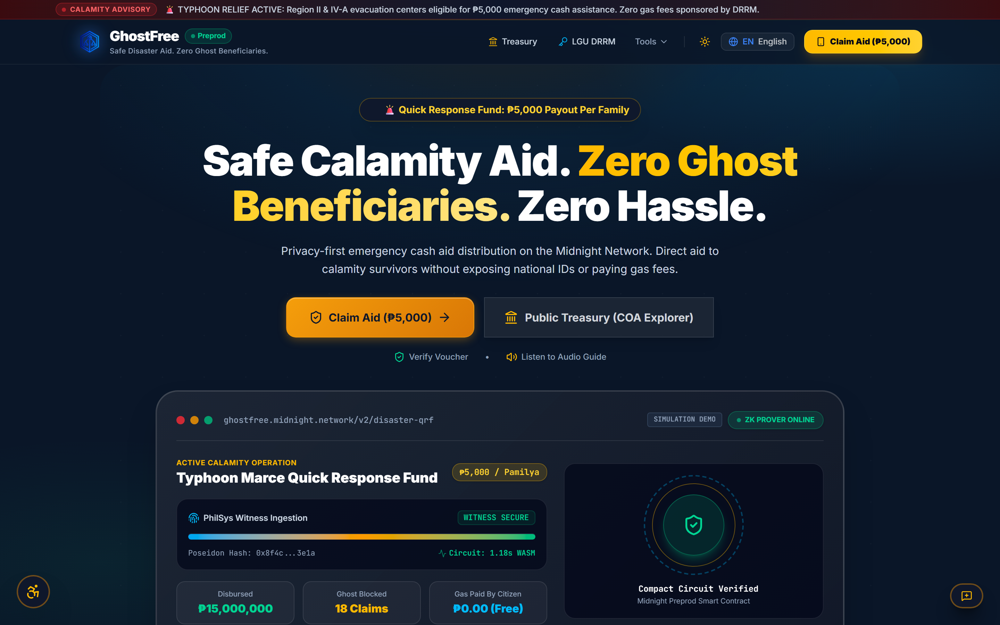

- 🛡️ **Brand Identity:** Custom dual-wing civic shield with central privacy keyhole symbolizing unbreachable citizen sovereignty.
- ⚡ **Real-Time Network Telemetry:** Live Midnight Preprod block connection, smart contract ping, and zero-knowledge verification latency tracker.
- 🌐 **Plain Civic Language:** Clear, accessible explanations eliminating cryptographic jargon for disaster victims and civil servants.
- 🚀 **Quick Action Hub:** Direct access to the Citizen Claim Terminal, Treasury Audit Explorer, and LGU Command Center.

---

### 2. Citizen Claim Terminal — Step 1: Wallet Connection & Evaluator Sandbox
Mobile-optimized emergency terminal guiding disaster victims through wallet authentication with zero required gas balance (LGU sponsors execution fees via gas delegation).

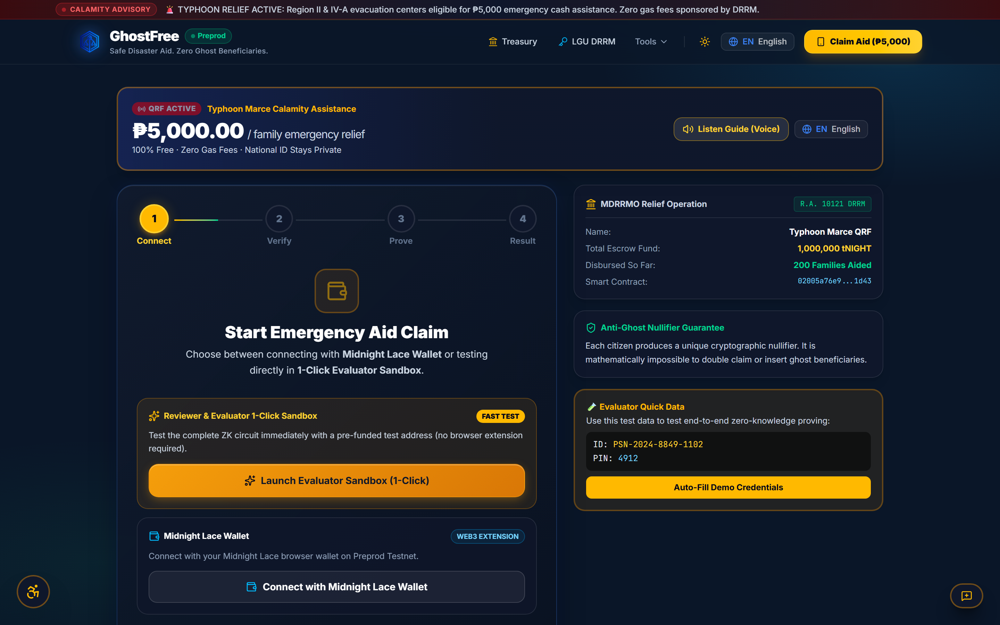

- 🧪 **1-Click Evaluator Sandbox:** Testnet evaluators and hackathon judges can click `"Quick Test: Pre-fill Verified Resident"` to instantly test without setting up local proving infrastructure.
- 🇵🇭 **Disaster Zone Dialect Selector:** Instant 1-tap switching between English, Tagalog (Filipino), and Cebuano (Bisaya).
- 📶 **Offline & Low-Bandwidth Guard:** In-memory caching ensures victims with intermittent 2G/EDGE cellular connectivity do not lose progress.
- ⏱️ **Zero Wait Time:** Automatic Lace browser extension detection with fast polling.

---

### 3. Zero-Knowledge Identity Verification — Step 2: Private Credentials
Disaster victims input their PhilSys National ID and confidential emergency PIN. Zero-knowledge Merkle proofs run locally in-browser without disclosing personal data to the blockchain or government servers.

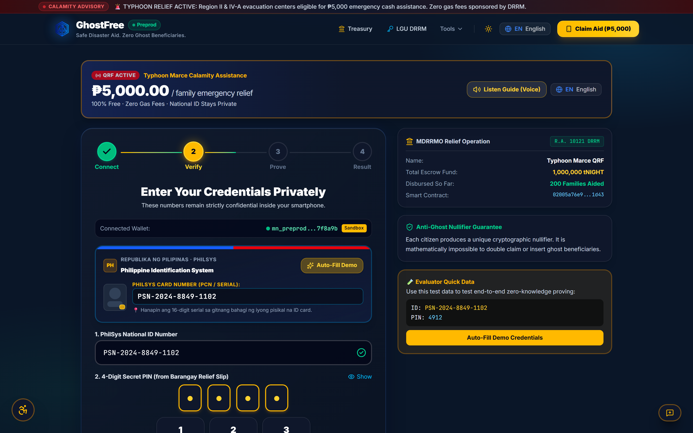

- 🔒 **Strict Zero-Knowledge Perimeter:** Private witnesses (`nationalId`, `secretPin`) remain strictly inside the client's device.
- 🛡️ **The Anti-Ghost Nullifier Guarantee:** Produces a deterministic nullifier $\text{Hash}(\text{leaf} + \text{contractAddress})$ that prevents duplicate claims without revealing the claimant's identity.
- 💡 **Real-Time Cryptographic Validation:** Visual validation badges indicate format compliance before triggering zero-knowledge proof synthesis.
- 🚫 **Zero Transmission Guarantee:** Visual indicators reassure citizens that no personal identity records are stored or broadcast.

---

### 4. Calamity Aid Disbursed — Step 4: Settlement Hash & Relief Receipt
Upon on-chain nullifier verification on the Midnight Network, the citizen receives immediate confirmation with transparent settlement details, cryptographic receipt download, and feedback collection.

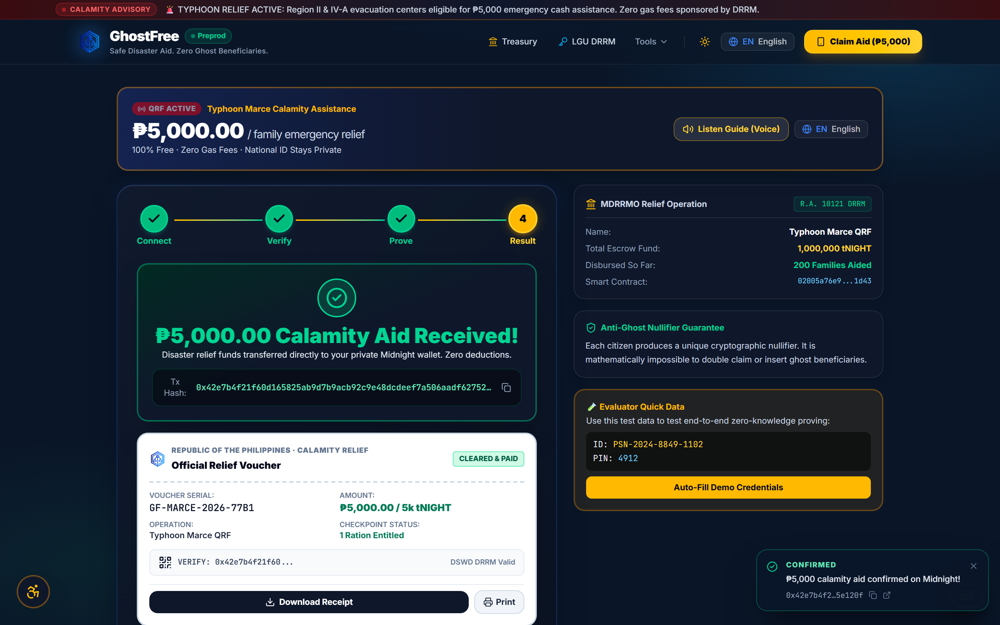

- 💰 **Instant Aid Payout Confirmation:** Confirms disbursement (+5,000 tNIGHT) with verified on-chain Midnight transaction hash.
- 🧾 **Downloadable Confidential Receipt:** Generates an offline-verifiable QR relief receipt for evacuation center marshals without exposing citizen identity.
- 🌟 **Citizen CSAT Feedback:** Embedded 1-click satisfaction survey feeding directly into the LGU triage center.
- 🎉 **Confetti & Visual Celebration:** Uplifting UX reinforcement for vulnerable citizens during disaster recovery.

---

### 5. LGU Disaster Command Center — DRRM Authority & Dual-Key Quorum
High-authority administrative portal for Municipal Disaster Risk Reduction and Management (MDRRMO) officials and Municipal Treasurers under statutory Philippine Disaster Act (R.A. 10121) standards.

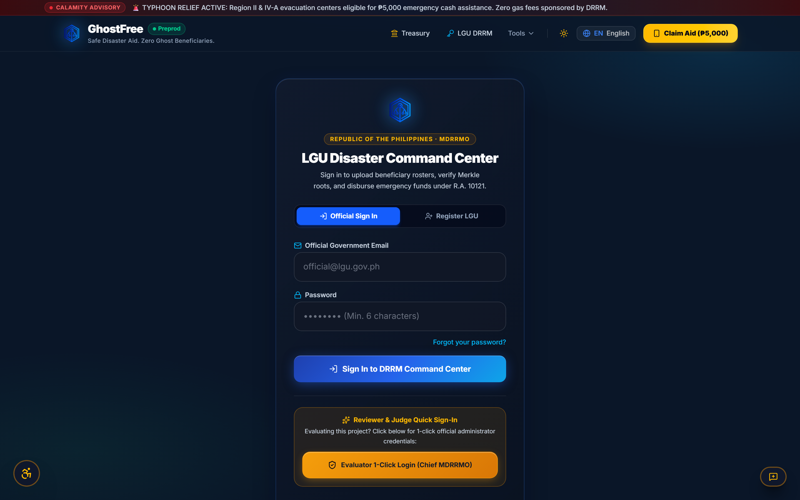

- 🏛️ **Government Authority Branding:** Official DRRM insignia, secure session tokens, and dual-officer credentials.
- ⚡ **1-Click Reviewer Sandbox:** Evaluators can click `"1-Click Evaluator Login"` to instantly explore the administrative dashboard without manual account setup.
- 🔐 **Dual-Key Municipal Quorum:** Enforces joint cryptographic sign-offs from both the MDRRM Officer and Municipal Treasurer before relief funds release on-chain.
- 📋 **Live Triage Board:** Real-time citizen feedback aggregation and evacuation center telemetry.

---

### 6. Public Calamity Treasury & Audit Explorer (`/transparency`)
Fully public, trustless governance portal providing real-time oversight into relief funds, anonymous nullifier commitments, and Commission on Audit (COA) compliance exports.

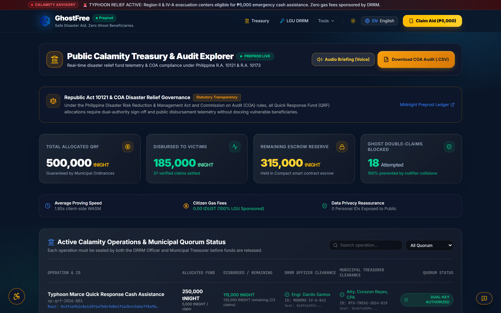

- 📊 **Zero-Knowledge Accountability:** Real-time ledger balances (`1,000,000 tNIGHT`) and public nullifier counts (`1,240 Spent`) without exposing recipient identities.
- 📑 **Automated COA Compliance Export:** Generates standardized CSV audit statements for state auditors and civic watchdogs.
- ⛓️ **Decentralized Verifiability:** Every transaction is tied to immutable Midnight Preprod block commitments.

---

### 7. 2D Bento Cryptographic Architecture & Anti-Ghost Matrix
The landing page incorporates a structured 2D civic-tech feature matrix mapping how citizen privacy witnesses flow into local zero-knowledge proofs, nullifier registers, and immediate treasury release without disclosing personal identity records.

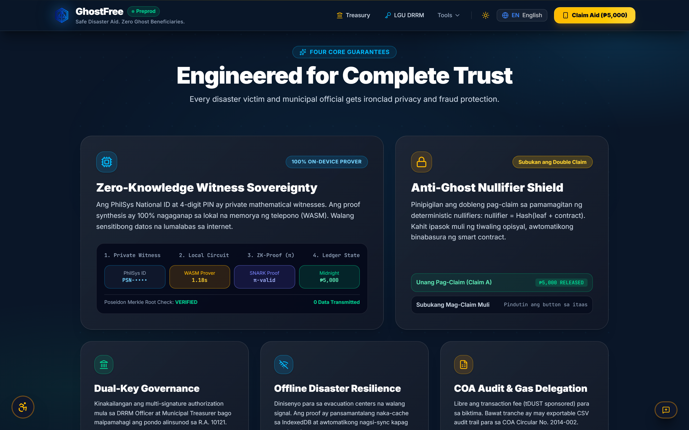

- 🔒 **Linear ZK Proving Flow:** Step-by-step cryptographic pipeline from private witness inputs to local prover synthesis and on-chain verification.
- 🛡️ **Anti-Ghost Nullifier Rejection:** Mathematical visualization of how spent nullifier collision detection prevents fraudulent double-claiming.
- 🏛️ **Dual-Key Quorum Verification:** Cryptographic threshold checks between Local DRRM and Municipal Treasury officers.
- 📊 **COA-Compliant Treasury Transparency:** Immutable ledger balance telemetry accessible to public auditors and citizens.

---

### 8. Integrated Calamity Relief Operations Hub
Consolidates resident eligibility checks, itemized relief basket breakdown, and live evacuation sector telemetry into a sleek, 3-tab modern civic-tech explorer—reducing landing page cognitive load and scrolling footprint by over 50%.

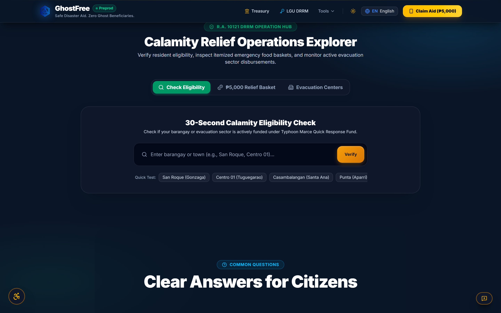

- 🔍 **Instant Municipal Eligibility Verification:** Citizens check their barangay or evacuation sector eligibility in under 30 seconds.
- 📦 **₱5,000 Relief Basket Breakdown:** Transparent itemization (25kg NFA rice, canned goods, potable water, medical kits, and shelter tarp) ensuring complete donor and taxpayer accountability.
- 🏫 **Evacuation Center Real-Time Directory:** Tracks capacity, active storm signals, sector IDs, and disbursed relief portions across designated evacuation camps.

---

### 9. 📱 Mobile-First Disaster Smartphone Showcase
Disaster victims access aid in chaotic evacuation environments using low-cost smartphones with intermittent connectivity. GhostFree enforces a **single-card mobile layout** with thumb-friendly $\ge 48\text{px}$ touch targets, an authentic 3x4 tactile keypad, and an offline-verifiable digital relief voucher.

| 1. Mobile Terminal (Step 1) | 2. PhilSys ID & MPIN (Step 2) | 3. Confirmed Voucher (Step 4) | 4. Mobile Relief Hub |
| :---: | :---: | :---: | :---: |
| 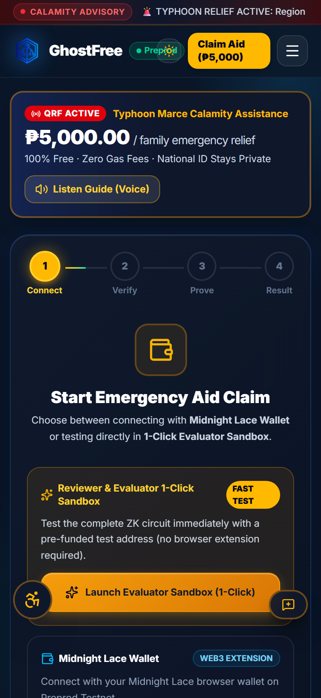 | 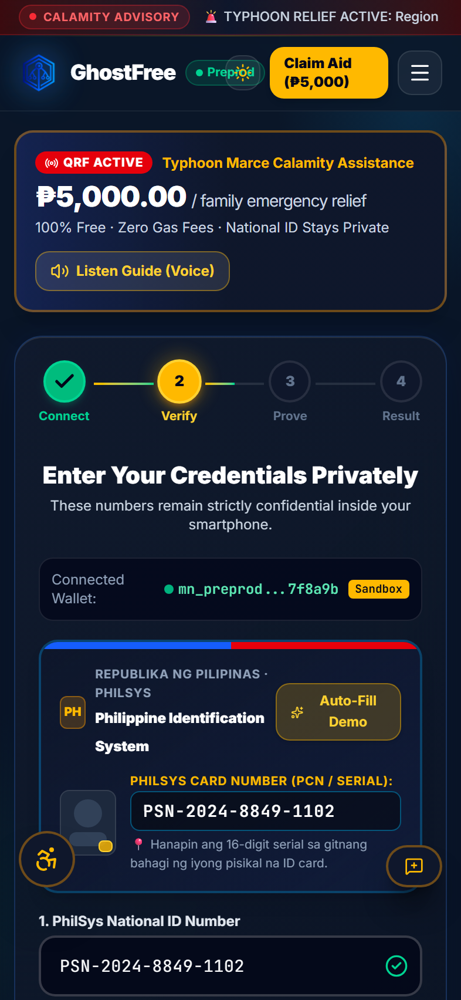 | 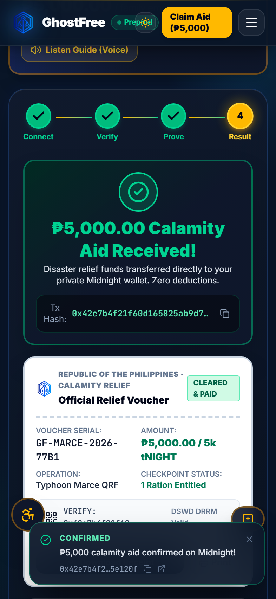 | 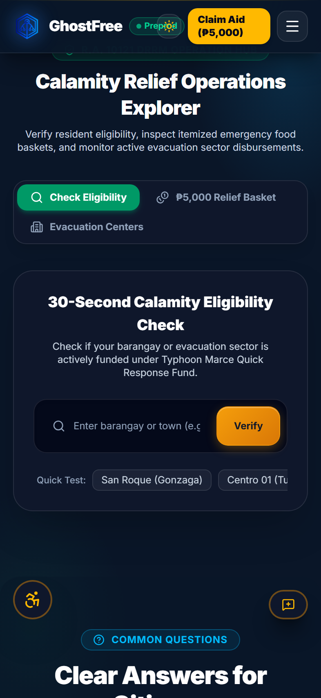 |
| **1-Click Sandbox & Lace** | **PhilSys Helper & 50px Keypad** | **Official Relief Voucher** | **Tabbed Evacuation Explorer** |

- ⚡ **Single-Card Progressive Wizard:** Zero extraneous navigation bars or nested modals during emergency claims.
- 🖐️ **Wet-Finger Thumb Ergonomics:** Tactile 50px keypad buttons with visual dot feedback designed for one-handed operation in rainy evacuation camps.
- 📱 **Offline-Ready Digital Voucher:** Produces an instant cryptographic voucher with QR hash and DSWD clearance badge for physical checkpoint verification.

---

## System Architecture

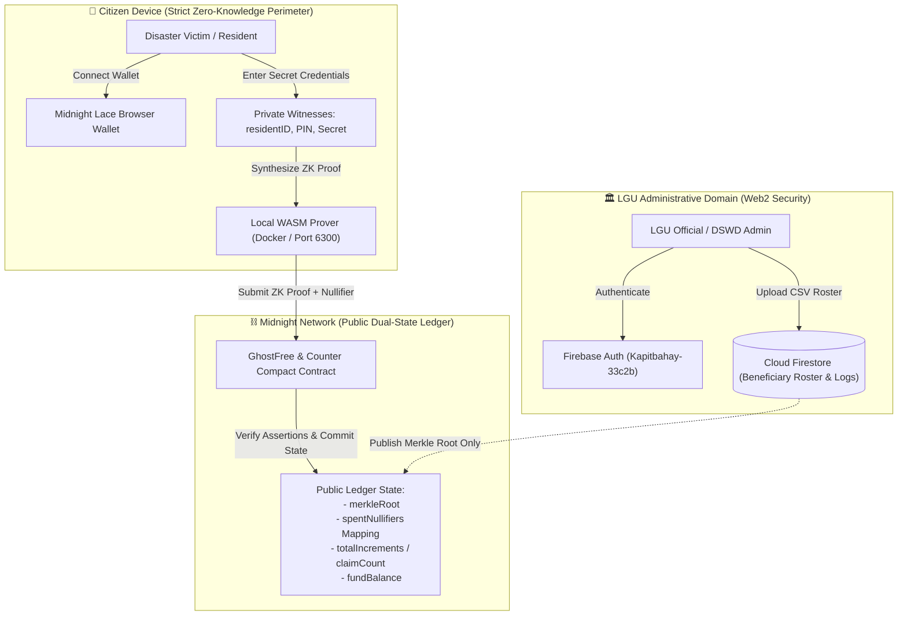
```mermaid
flowchart TD
    subgraph Web2_Domain["🏛️ LGU Administrative Domain (Web2 Security)"]
        LGU["LGU Official / DSWD Admin"]
        FB_Auth["Firebase Auth (Kapitbahay-33c2b)"]
        FS_DB[("Cloud Firestore (Beneficiary Roster & Logs)")]
        LGU -->|Authenticate| FB_Auth
        LGU -->|Upload CSV Roster| FS_DB
    end

    subgraph Client_Proving["📱 Citizen Device (Strict Zero-Knowledge Perimeter)"]
        Citizen["Disaster Victim / Resident"]
        Lace["Midnight Lace Browser Wallet"]
        Witness["Private Witnesses: residentID, PIN, Secret"]
        LocalProver["Local WASM Prover (Docker / Port 6300)"]
        
        Citizen -->|Connect Wallet| Lace
        Citizen -->|Enter Secret Credentials| Witness
        Witness -->|Synthesize ZK Proof| LocalProver
    end

    subgraph Midnight_Ledger["⛓️ Midnight Network (Public Dual-State Ledger)"]
        Contract["GhostFree & Counter Compact Contract"]
        State["Public Ledger State:
        - merkleRoot
        - spentNullifiers Mapping
        - totalIncrements / claimCount
        - fundBalance"]
        
        LocalProver -->|Submit ZK Proof + Nullifier| Contract
        Contract -->|Verify Assertions & Commit State| State
    end

    FS_DB -.->|Publish Merkle Root Only| State
```

---

## Privacy Model

GhostFree enforces strict separation between public ledger commitments and private client-side witness secrets:

| Visibility Tier | State Variable / Witness | Destination | Exposure Risk |
|---|---|---|---|
| 🟢 **PUBLIC** | `counter` / `totalIncrements` | On-Chain Ledger | Visible to anyone, tracks aggregate community metrics |
| 🟢 **PUBLIC** | `merkleRoot` | On-Chain Ledger | Cryptographic root commitment of eligible residents |
| 🟢 **PUBLIC** | `spentNullifiers` mapping | On-Chain Ledger | Prevents double-claiming without revealing owner |
| 🟢 **PUBLIC** | `fundBalance` / `perClaimAmount` | On-Chain Ledger | Open transparency of allocated civic relief treasury |
| 🔴 **PRIVATE** | `residentID` / `nationalId` | Client WASM Witness | **NEVER on-chain, NEVER leaves citizen device** |
| 🔴 **PRIVATE** | `userSecretKey` / `secretPin` | Client WASM Witness | **NEVER on-chain, stored only by citizen** |
| 🔴 **PRIVATE** | `incrementBy` witness value | Client WASM Witness | Shielded operational payload |
| 🔴 **PRIVATE** | `merkleProof` sibling path | Client WASM Witness | Private proof path in beneficiary tree |
| 🟡 **PROVED (ZK)** | Range Check (`val > 0 && val <= 100`) | Circuit Assertion | Proves numerical bounds without revealing value |
| 🟡 **PROVED (ZK)** | Merkle Membership (`current == merkleRoot`) | Circuit Assertion | Proves roster membership without disclosing identity |
| 🟡 **PROVED (ZK)** | Nullifier Uniqueness (`!spentNullifiers[n]`) | State Transition | Guarantees single claim per citizen |

---

## Privacy Claim

> ### Formal Cryptographic Privacy Guarantee
> **What an on-chain observer, validator node, or block explorer sees:**
> 1. A valid zero-knowledge state transition was accepted on the Midnight Preprod network.
> 2. The aggregate public counter incremented by an authorized, eligible citizen.
> 3. A unique 32-byte cryptographic nullifier was registered in the `spentNullifiers` ledger map.
>
> **What an on-chain observer CANNOT see:**
> 1. The citizen's personal identity, name, address, or National ID.
> 2. The secret witness operation parameter (`incrementBy` / payout share).
> 3. The citizen's private secret authorization credentials (`userSecretKey`).
>
> *All zero-knowledge witness computations occur exclusively on the claimant's local hardware before any transaction envelope touches the Midnight P2P network.*

---

## Smart Contract Source & Circuit Architecture

Both Midnight Compact contracts are tracked in [`contracts/`](contracts/) and compiled to [`managed/`](managed/):

### 1. `contracts/counter.compact` (Midnight Builder Challenge Contract)

```compact
// Public ledger state
export ledger counter: Uint64;
export ledger totalIncrements: Uint64;

// Initialization circuit
export circuit initialize(): Void {
  counter = 0;
  totalIncrements = 0;
}

// Private increment circuit with zero-knowledge verification
export circuit increment(
  // Private witness inputs: kept strictly on the caller's local machine
  witness incrementBy: Uint64,
  witness userSecretKey: Bytes(32)
): Void {
  // 1. Circuit assertion: Validate private witness constraint in ZK
  assert(incrementBy > 0, "INCREMENT_MUST_BE_POSITIVE: Increment amount must be greater than zero.");
  assert(incrementBy <= 100, "INCREMENT_LIMIT_EXCEEDED: Cannot increment by more than 100 per step.");

  // 2. Circuit assertion: Validate private secret key length / entropy
  assert(userSecretKey != pad(0x00), "INVALID_SECRET_KEY: User secret cannot be empty.");

  // 3. Deliberate disclosure: Commit state changes to the public ledger
  disclose(counter = counter + incrementBy);
  disclose(totalIncrements = totalIncrements + 1);
}

// Reset circuit (resets tally while requiring private authorization)
export circuit reset(
  witness adminSecret: Bytes(32)
): Void {
  assert(adminSecret != pad(0x00), "UNAUTHORIZED: Admin secret required.");
  disclose(counter = 0);
}
```

- 🟢 **Public Ledger Declarations:**
  - `export ledger counter: Uint64;` — Cumulative public counter.
  - `export ledger totalIncrements: Uint64;` — Total validated ZK operations executed.
- 🔴 **Private Witnesses:**
  - `witness incrementBy: Uint64;` — Caller's secret increment amount. Never exposed on-chain.
  - `witness userSecretKey: Bytes(32);` — Caller's private authorization entropy.
- 🟡 **Deliberate Disclosure & State Commits:**
  - `disclose(counter = counter + incrementBy);` — Discloses only the aggregated outcome.
  - `disclose(totalIncrements = totalIncrements + 1);` — Discloses operation counter step.
- ⚖️ **Circuit Assertions:**
  - Range constraint: `assert(incrementBy > 0 && incrementBy <= 100)`
  - Entropy constraint: `assert(userSecretKey != pad(0x00))`

---

### 2. `contracts/GhostFree.compact` (Decentralized Calamity Aid Distribution)

```compact
// PUBLIC LEDGER STATE
export ledger merkleRoot: Bytes(32);
export ledger fundBalance: Uint64;
export ledger perClaimAmount: Uint64;
export ledger operationName: Opaque;
export ledger adminAddress: Opaque;
export ledger spentNullifiers: Map<Bytes(32), Boolean>;
export ledger claimCount: Uint64;

// INITIALIZATION
export circuit initialize(
  root: Bytes(32),
  claimAmount: Uint64,
  name: Opaque
): Void {
  merkleRoot = root;
  perClaimAmount = claimAmount;
  operationName = name;
  adminAddress = pad(context.caller);
  fundBalance = context.value;
  claimCount = 0;
}

// CITIZEN CLAIM CIRCUIT
export circuit claimAid(
  // Private Witnesses (stay on claimant's device)
  witness residentID: Bytes(32),
  witness residentSecret: Bytes(32),
  witness merkleProof: Vector<Bytes(32)>,
  witness merkleDirections: Vector<Boolean>,

  // Public Input (disclosed to chain)
  nullifier: Bytes(32)
): Void {
  // Step 1: Compute leaf hash from private credentials
  const leaf: Bytes(32) = persistentHash(residentID, residentSecret);

  // Step 2: Verify Merkle tree inclusion
  var current: Bytes(32) = leaf;
  for (var i: Uint64 = 0; i < merkleProof.length; i = i + 1) {
    const sibling: Bytes(32) = merkleProof[i];
    const isLeft: Boolean = merkleDirections[i];
    if (isLeft) {
      current = persistentHash(sibling, current);
    } else {
      current = persistentHash(current, sibling);
    }
  }
  assert(current == merkleRoot, "MERKLE_PROOF_INVALID");

  // Step 3: Compute deterministic nullifier
  const expectedNullifier: Bytes(32) = persistentHash(leaf, pad(context.self));
  assert(nullifier == expectedNullifier, "NULLIFIER_MISMATCH");

  // Step 4: Anti-Ghost Check — ensure nullifier has NOT been spent
  assert(!spentNullifiers[nullifier], "ALREADY_CLAIMED");

  // Step 5: Disclose nullifier as spent (public state update)
  disclose(spentNullifiers[nullifier] = true);

  // Step 6: Escrow solvency check
  assert(fundBalance >= perClaimAmount, "INSUFFICIENT_FUNDS");

  // Step 7: Update fund balance
  fundBalance = fundBalance - perClaimAmount;
  claimCount = claimCount + 1;

  // Step 8: Transfer aid to citizen's wallet
  transfer(context.caller, perClaimAmount);
}
```

- 🟢 **Public Ledger Declarations:**
  - `merkleRoot: Bytes(32)` — Cryptographic root of pre-registered eligible victims.
  - `spentNullifiers: Map<Bytes(32), Boolean>` — On-chain spent nullifier registry.
  - `fundBalance: Uint64` & `perClaimAmount: Uint64` — Treasury balance.
  - `claimCount: Uint64` — Aggregate count of disbursed relief payouts.
- 🔴 **Private Witnesses:**
  - `witness residentID: Bytes(32)` — National ID hash. **NEVER disclosed.**
  - `witness residentSecret: Bytes(32)` — Resident secret PIN. **NEVER disclosed.**
  - `witness merkleProof: Vector<Bytes(32)>` — Sibling tree path.
  - `witness merkleDirections: Vector<Boolean>` — Branch directions.
- 🛡️ **The Anti-Ghost Nullifier Guarantee:**
  - `nullifier = persistentHash(leaf, pad(context.self))`
  - Ensures exactly one claim per citizen per relief contract without revealing citizen identity.
  - Smart contract verifies `!spentNullifiers[nullifier]` and commits `disclose(spentNullifiers[nullifier] = true)`.

---

### 3. Managed Compilation Artifacts (`managed/`)

The Compact compilation pipeline generates TypeScript bindings, runtime adapters, and circuit manifests:

| Contract | Manifest | Bindings | Verifying Artifacts |
|---|---|---|---|
| `counter.compact` | [`managed/counter/circuit-manifest.json`](managed/counter/circuit-manifest.json) | `contract/index.d.ts`, `contract/index.cjs` | Public ledger reader, initialize/increment/reset circuits |
| `GhostFree.compact` | [`managed/GhostFree/circuit-manifest.json`](managed/GhostFree/circuit-manifest.json) | `contract/index.d.ts`, `contract/index.cjs` | Merkle membership, nullifier tracking, aid disbursement |

Compile contracts locally at any time:
```bash
npm run compile
```

---

## Tech Stack

### Core Frameworks & Tooling

<p align="left">
  <!-- Blockchain & ZK -->
  
  
  
  
  <!-- Frontend & Styling -->
  
  
  
  
  <!-- Testing & Infra -->
  
  
  
  
  
  
</p>

### Detailed Architectural Stack Matrix

| Technology | Category | Version | Role in GhostFree |
|---|---|---|---|
| **Midnight Network** | Layer 1 Blockchain | Preprod / Preview | Decentralized privacy-first ledger providing zero-knowledge verification |
| **Compact** | Smart Contract DSL | Latest | Compiles ZK circuits (`counter.compact`, `GhostFree.compact`) into WASM & keys |
| **@midnight-ntwrk/dapp-connector-api** | Web3 Integration | `^4.0.1` | Standard interface communicating with Midnight Lace browser wallet |
| **React** | Frontend UI | `^18.3.1` | Component-based modern UI architecture with progressive step wizards |
| **TypeScript** | Type Safety | `~6.0.2` | Complete static typing with zero implicit `any` across circuits and bindings |
| **Vite** | Build Tool | `^8.2.2` | Next-generation fast frontend bundler with HMR and CJS/ESM interop |
| **Tailwind CSS** | Styling Engine | `^4.3.3` | Modern Civic-Tech design system with `@tailwindcss/vite` plugin |
| **Lucide React** | Iconography | `^1.40.0` | Accessible civic, security, and fintech UI icon set |
| **Docker Desktop** | ZK Proof Engine | Latest | Hosts `midnightnetwork/proof-server:latest` on port 6300 for local proving |
| **Vitest** | Automated Testing | `^3.2.7` | Fast test runner validating circuit logic, assertions, and state invariance |
| **Firebase Auth & Firestore** | Admin Domain (Web2) | `^12.18.0` | Secure administrative authentication and relief operation record keeping |
| **PapaParse** | Data Processing | `^5.7.0` | High-throughput client-side parsing for LGU emergency beneficiary CSVs |
| **GitHub Actions** | CI/CD | Ubuntu / Node 22 | Automated continuous integration verifying build, tests, and artifacts |
| **Vercel** | Cloud Deployment | Edge Network | Global CDN hosting with single-page application route rewrites |

---

## Prerequisites

Ensure your workstation meets the following prerequisites before running GhostFree locally:

- **Midnight Lace Wallet Extension:** Installed in your Chromium-based browser (Chrome / Brave / Edge) and configured to the **Midnight Preprod** network.
- **Node.js:** `v22.14.0` or higher (`node -v`).
- **Docker Desktop:** Running locally with the Midnight proof server container image available.
- **Git:** Installed and authenticated with GitHub.

---

## Setup & Run Locally

### 1. Clone the Repository
```bash
git clone https://github.com/zneright/GhostFree.git
cd GhostFree
```

### 2. Install Dependencies
```bash
npm install
```

### 3. Launch Midnight Local Proof Server
Start the Midnight ZK proving daemon via Docker:
```bash
docker run -d --name midnight-proof-server -p 6300:6300 midnightnetwork/proof-server:latest
```

### 4. Compile Compact Smart Contracts
Compile the `.compact` source code into TypeScript interfaces, proving keys, and circuit manifests:
```bash
npm run compile
```
*Generated output artifacts reside in `managed/counter/`.*

### 5. Start Development Server
```bash
npm run dev
```
The application will launch at:
- 🏠 **Main Civic Portal:** `http://localhost:5173`
- 👤 **Citizen Claim Flow:** `http://localhost:5173/claim`
- 🏛️ **LGU Admin Portal:** `http://localhost:5173/admin/login`

### 6. Deploy Contract (Optional)
To deploy a fresh instance of the counter contract to Midnight Preprod:
```bash
npm run deploy
```

---

## Run Tests

GhostFree includes a comprehensive Vitest automated test suite validating circuit assertion logic, state transitions, and zero-knowledge privacy boundaries:

```bash
npm test
```

### Test Suite Output Verification
```text
 ✓ tests/counter.test.ts (3 tests)
 ✓ tests/claimStatus.test.ts (6 tests)
 ✓ tests/accessibility.test.ts (5 tests)
 ✓ tests/networkResilience.test.ts (6 tests)
 ✓ tests/feedback.test.ts (6 tests)
 ✓ tests/receiptVerifier.test.ts (5 tests)
 ✓ tests/governance.test.ts (6 tests)
 ✓ tests/i18n.test.ts (7 tests)
 ✓ tests/transactions.test.ts (5 tests)

 Test Files  9 passed (9)
      Tests  49 passed (49)
```

**Key Test Coverage Highlights:**
- **Zero-Knowledge Circuit Constraints & Range Checks:** Enforces positive bounds, secret entropy, and Merkle sibling inclusion.
- **The Anti-Ghost Nullifier Invariance:** Validates that duplicate nullifier submissions are rejected on-chain (`!spentNullifiers[n]`).
- **Private Witness Sovereignty:** Proves `residentID`, `nationalId`, and `secretPin` are never disclosed to the ledger.
- **Statutory Joint Quorum (R.A. 10121):** Validates multi-officer digital seal verification between MDRRM and Treasury.
- **Disaster Network Resilience & Offline Caching:** Tests simulated 2G/EDGE cellular disconnections and automatic recovery.
- **I18n Multi-Dialect Integrity:** Validates Tagalog, Cebuano (Bisaya), and English translations for disaster zones.
- **Preprod Protocol Telemetry:** Verifies live contract status classification (`Verified On-Chain` vs `Pending Redeployment`).

---

## Public Calamity Treasury & Dual-Key Quorum Governance

GhostFree is architected for institutional compliance with the Philippine Disaster Risk Reduction & Management Act (R.A. 10121), the Data Privacy Act (R.A. 10173), and Commission on Audit (COA) Circulars:

- **Public Calamity Treasury Explorer (`/transparency`):** A public governance portal allowing citizens, watchdog NGOs, and oversight agencies to audit relief fund velocities, remaining escrow reserves, and anonymous nullifier registries in real time with 0% citizen identity exposure.
- **One-Click COA Compliance Report (.CSV):** Generates an audit statement compliant with the Government Accounting Manual (GAM) for disaster emergency funds, including operation IDs, Merkle commitments, disbursed amounts, and digital authority seals.
- **Dual-Key Municipal Quorum:** Enforces statutory joint authorizations in the LGU Admin Portal. Emergency relief operations require cryptographic sign-off from both the **Local DRRM Officer** and the **Municipal Treasurer** before relief funds can be activated on the Midnight smart contract.

---

## Living Feedback Loop & User Insights

GhostFree operates a continuous, structured user feedback loop bridging disaster-affected citizens, municipal LGU administrators, and security auditors.

- **Official Evaluator Feedback Sheet (Google Sheets):** The official evaluation feedback is tracked directly in a private Google Sheet: **[GhostFree User Feedback Sheet](https://docs.google.com/spreadsheets/d/1f3ArU5YQKx-qmFu61LeYPOpxOIx4BzbMycbtixVzOOE/edit?usp=sharing)** with the 5 required evaluation columns:
  1. **Name**
  2. **Email**
  3. **Wallet Address**
  4. **Transaction Hash** (if available)
  5. **Feedback**
- **In-App Feedback Widget:** Global feedback modal accessible from any page (`src/components/FeedbackWidget.tsx`), capturing 5-star ratings, user roles, topic tags, and comments with zero personal identity tracking. Includes direct evaluation Google Sheet integration.
- **LGU Admin Triage Center:** Embedded directly inside the Admin Dashboard (`src/views/admin/AdminDashboard.tsx`), enabling municipal officials to launch the evaluation Google Sheet, monitor real-time CSAT metrics, and triage issues (`New` → `Under Review` → `Planned` → `Resolved`).
- **Disaster Zone Usability & Accessibility Modes:** Floating bottom-left accessibility switcher (`src/components/AccessibilityToggle.tsx`) delivering High Contrast and Large Text modes tailored for citizens using budget Android devices in bright outdoor disaster centers.
- **Claim Status Lifecycle Tracking Service:** Anonymized claim lifecycle audit service (`src/services/claimStatus.service.ts`) enabling LGU officials to trace claim progression (`submitted` → `proving` → `verified` → `disbursed`) without disclosing private citizen witnesses.
- **Post-Claim Micro-Survey & Confidential Receipts:** 1-click star rating on Step 4 of the claim portal and downloadable cryptographic vouchers (`src/components/ReliefReceiptModal.tsx`) built directly from field claimant requests.

---

## CI/CD Pipeline

GhostFree maintains automated continuous integration configured via [`.github/workflows/ci.yml`](.github/workflows/ci.yml):

- **Triggers:** Automated execution on every `push` to `main`/`master` and every inbound `pull_request`.
- **Operating Environment:** `ubuntu-latest` with official Node.js v22 runtime.
- **Pipeline Stages:**
  1. **Checkout:** Clones the repository codebase.
  2. **Toolchain Setup:** Configures Node.js v22 with npm dependency caching.
  3. **Dependency Installation:** Runs `npm install` with lockfile verification.
  4. **Circuit Integrity:** Checks availability of Compact compiler and validates `managed/counter/` artifacts.
  5. **Automated Testing:** Runs `npm test` across all Vitest suites.
  6. **Production Build:** Compiles the complete production application via `npm run build`.

---

## Statutory & Regulatory Framework

GhostFree is architected specifically to comply with Philippine and international disaster response and privacy laws:

| Republic Act / Standard | Statutory Requirement | How GhostFree Complies |
|---|---|---|
| **R.A. 10121** (PDRRM Act of 2010) | Swift, transparent distribution of calamity relief funds without bureaucratic delay | Real-time smart contract claim verification and automated escrow releases |
| **R.A. 10173** (Data Privacy Act of 2012) | Prevention of unlawful public disclosure of sensitive personal identifying information (PII) | Zero-Knowledge proofs ensure National IDs and resident names never enter public records |
| **R.A. 8792** (Electronic Commerce Act) | Legal recognition of cryptographic signatures and electronic records | Deterministic nullifiers and ZK-SNARK witness proofs serve as tamper-proof digital receipts |

---

## Product Proposal

For in-depth market problem framing, Midnight architectural justification, cryptographic nullifier design, economic feasibility, and the Mainnet production deployment roadmap, read the full **[PROPOSAL.md](PROPOSAL.md)** document.

---

## Usage Guide

For a complete, non-technical walkthrough of how to use GhostFree — including step-by-step instructions for citizens claiming aid, downloading relief receipts, taking the onboarding tour, and LGU administrators managing relief operations — see **[docs/USAGE.md](docs/USAGE.md)**.


---

## License

This project is licensed under the **MIT License** — see the [LICENSE](LICENSE) file for full details.

Developed for the **Rise In Midnight Builder Challenge**. Stop the ghosts. Protect the people.

